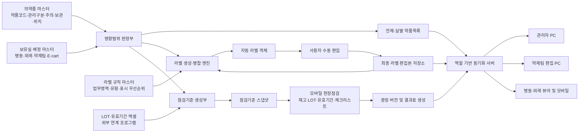
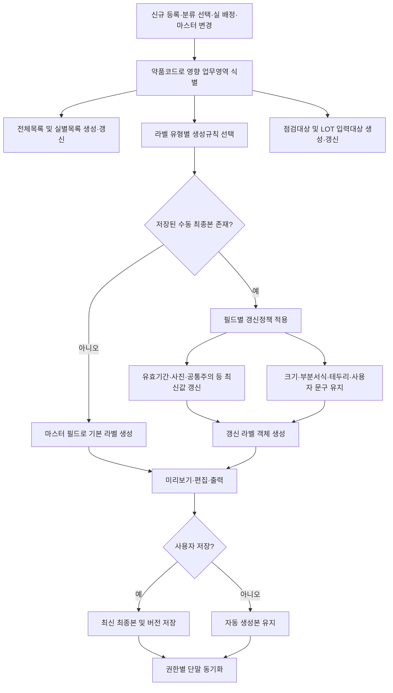
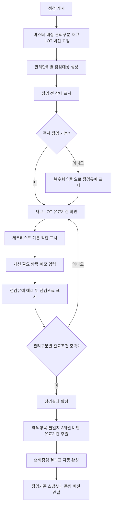

# 특허청구범위 최종 검토안

## 1. 발명의 명칭

**의약품 마스터의 관리구분 및 보유실 배정에 따른 업무객체 자동 생성, 라벨 편집본 보존 및 버전 고정형 점검을 수행하는 약제업무 통합 관리 시스템 및 그 방법**

## 2. 문서의 성격 및 검토 결론

1. 본 문서는 업로드된 「특허청구범위 최종안」을 마크다운 형식으로 재구성하고, `비품관리` 폴더에 구현되거나 설계된 비품약·마약류·E-cart 점검, 약제팀 라벨, 약품장 라벨, 마스터 관리, 보유실 배정, 엑셀 연계, 모바일·PC 동기화 및 보고서 자동 생성 구조를 반영한 수정안입니다.
2. 기존 최종안은 관리구분, LOT 단위 점검, 점검기준 스냅샷 및 증빙 버전 관리에는 강점이 있으나, 다음 핵심 기능이 청구항에 충분히 반영되지 않았습니다.
   1. 의약품을 보유실에 한 번 배정하면 전체 약품목록, 해당 실 목록, 라벨 출력대상 및 점검대상이 함께 생성되는 구조
   2. 의약품 마스터의 분류 선택 한 번으로 병동과 약제팀의 목록·라벨·점검 영역에 변경 내용이 선택적으로 전파되는 구조
   3. 약제팀 라벨 및 약품장 라벨의 자동 생성 후 수동 편집을 허용하고, 수동 편집본을 검색·출력의 최종본으로 보존하는 구조
   4. 마스터에서 갱신되어야 하는 필드와 사용자가 보존하려는 편집 필드를 구분하여 병합하는 구조
   5. 약품 위치 고유기호, 식별사진, 유효기간, ATC 및 주의·보관 정보를 라벨 유형별 규칙에 따라 결합하는 구조
   6. 관리자·편집자·뷰어의 권한과 모바일·PC 간 공용 서버 동기화 구조
3. 단순히 “엑셀을 앱으로 변환한다”, “모바일과 PC를 연동한다” 또는 “라벨을 자동 출력한다”는 표현만으로는 선행기술과 구별되기 어렵습니다. 따라서 본 수정안은 다음 세 가지 데이터 처리 결합관계를 중심으로 권리범위를 구성합니다.
   1. **단일 변경의 다중 업무객체 전파:** 관리구분 또는 보유실 배정의 한 번의 변경으로 목록, 라벨, 점검대상 및 LOT 관리대상을 일관된 약품코드로 생성·갱신합니다.
   2. **자동 갱신과 수동 최종본의 선택적 병존:** 마스터 종속 필드는 최신값으로 갱신하되 사용자가 확정한 라벨 편집 필드는 유지합니다.
   3. **점검기준의 시점 고정과 증빙화:** 점검 개시 당시의 마스터·배정·LOT 기준을 고정하고, 완료조건을 충족한 점검결과와 자동 보고서를 해당 기준에 연결합니다.
4. 아래 청구항은 권리화 가능성을 높이기 위한 예비안입니다. 특허 등록 가능성을 보장하는 문서는 아니며, 출원 전 KIPRIS를 이용한 국내 선행기술 및 동일·유사 특허군의 청구항 대조가 필요합니다.

## 3. 비품관리 폴더 기능의 청구항 반영표

| 기능 영역 | 구현·설계 내용 | 권장 청구항 | 반영 수준 |
| --- | --- | --- | --- |
| 의약품 마스터 | 약품코드 중심의 명칭, 함량, 제형, 관리구분, 주의·보관, 위치, 라벨 속성 관리 | 1, 2, 11 | 핵심 구성 |
| 보유실 배정 | 약품을 실에 배정하면 전체목록, 실별목록, 라벨 및 점검대상이 함께 파생 | 1, 11 | 핵심 구성 |
| 마스터 변경 전파 | 신규 랜딩, 코드·명칭·회사·분류 변경을 관련 목록과 라벨에 자동 반영 | 1, 2, 4, 11, 12 | 핵심 구성 |
| 약제팀 약품명 라벨 | 원병, PTP, ATC, 입원산제, 외용, 앰플, 바이알, 냉장주사, 영양·일반수액, 마약·향정, 고가약, 항암제 등 | 1, 3 | 핵심·종속 구성 |
| 측면·뚜껑 라벨 | 일반·유색 측면라벨, 병뚜껑라벨, 1T·0.5T·0.25T, ATC·유효기간·식별사진 표시 | 3, 5 | 종속 구성 |
| 약품장 라벨 | 위치 고유기호별 선반라벨, 제형별 전체목록, 위치 변경 시 자동 재구성 | 3, 5 | 종속 구성 |
| 라벨 수동 편집 | 자동 생성본의 크기, 위치, 제목 부분서식, 테두리 등을 수정하고 최종본으로 저장 | 4, 12 | 핵심 종속 구성 |
| 최신값 병합 | 식별사진·유효기간·공통 주의정보는 갱신하고 수동 편집 필드는 보존 | 4, 12 | 차별화 구성 |
| 식별사진 연계 | 약품코드 또는 정규화한 약품명으로 관련 사이트의 식별사진을 매칭하고 출처 저장 | 5 | 종속 구성 |
| 공통·전용 분류 | 병동·E-cart 공통 필드와 약제팀 전용 라벨 유형을 분리하여 전파범위 제어 | 2 | 차별화 구성 |
| 역할별 연동 | 관리자, 편집자, 읽기 전용 뷰어에 화면·편집권한을 구분하고 서버 상태 공유 | 6 | 종속 구성 |
| 모바일·PC 동기화 | 여러 PC와 모바일이 공용 서버 상태를 폴링·병합하고 충돌을 검출 | 6 | 종속 구성 |
| 순회점검 현황 | 점검실·미점검실·점검유예실을 색상으로 구분하고 점검 입력 시 상태 해제 | 9 | 종속 구성 |
| 체크리스트 | 적합을 기본값으로 제공하고 개선 필요 항목과 메모를 예외로 입력 | 9 | 종속 구성 |
| 결과표 자동 생성 | 개선 필요 항목, 메모 및 3개월 미만 유효기간을 결과표에 자동 삽입 | 9 | 종속 구성 |
| 마약류 LOT | 연계 프로그램의 실별 재고 LOT 엑셀을 가져와 실제 LOT·유효기간 점검 | 7, 8 | 독립·종속 구성 |
| 버전 고정 점검 | 점검 개시 기준을 고정하고 진행 중 마스터 변경은 다음 점검부터 적용 | 7, 10, 11 | 핵심 구성 |
| 증빙 버전 | 확정 점검결과를 기준 스냅샷과 연결하고 정정 시 기존 결과를 보존 | 10, 12 | 핵심 구성 |
| 향후 약품 찾기 | 카메라로 약품명을 인식하고 위치 고유기호를 조회 | 명세서의 선택적 실시예 | 현재 청구 제외 권장 |

> 향후 약품 찾기 기능은 현재 개발 중인 기능이므로, 구체적인 인식·정규화·매칭 단계가 완성되지 않았다면 독립항에는 포함하지 않는 것이 안전합니다. 다만 위치 고유기호가 향후 영상 인식 결과와 연결될 수 있다는 선택적 실시예는 명세서에 기재할 수 있습니다.

## 4. 권장 특허청구범위

### 【청구항 1】 독립항 — 통합 관리 시스템

의약품 재고, 라벨 및 점검업무를 통합하여 관리하는 약제업무 관리 시스템에 있어서,

약품코드를 식별자로 하고 의약품의 명칭, 함량, 제형, 관리구분, 주의정보, 보관조건, 위치정보 및 라벨 속성 중 적어도 하나를 포함하는 의약품 마스터 데이터, 상기 의약품과 병동, 외래, 약제팀 또는 응급카트 중 어느 하나의 관리단위 간의 보유실 배정관계, 라벨 유형별 생성규칙, 필드별 갱신정책, 사용자 편집에 의해 확정된 라벨 편집본 및 점검결과를 저장하는 데이터 저장부; 및

상기 데이터 저장부와 연결되고 명령어를 실행하는 하나 이상의 프로세서를 포함하고,

상기 하나 이상의 프로세서는,

상기 의약품 마스터 데이터의 등록 또는 변경, 상기 관리구분의 선택 또는 변경, 및 상기 보유실 배정관계의 등록 또는 변경 중 어느 하나의 데이터 변경 이벤트를 검출하고,

상기 약품코드, 상기 관리구분 및 상기 보유실 배정관계에 기초하여, 원내 전체 약품목록, 상기 관리단위별 약품목록, 라벨 출력대상 및 점검대상을 포함하는 서로 다른 업무영역의 파생 업무객체를 하나의 처리에서 생성 또는 갱신하며,

상기 라벨 출력대상에 대하여 업무영역 및 라벨 유형에 대응하는 상기 라벨 유형별 생성규칙을 선택하고, 상기 의약품 마스터 데이터의 필드를 상기 생성규칙의 표시영역에 배치하여 라벨 객체를 자동 생성하며,

상기 라벨 객체에 대한 사용자 편집을 입력받아 상기 라벨 편집본으로 저장하고,

상기 데이터 변경 이벤트가 상기 라벨 편집본의 저장 후 발생하는 경우, 상기 필드별 갱신정책에 따라 마스터 종속 필드는 변경된 의약품 마스터 데이터로 갱신하고 사용자 확정 필드는 상기 라벨 편집본의 값으로 유지하여 갱신 라벨 객체를 생성하며,

상기 파생 업무객체 및 상기 갱신 라벨 객체를 사용자 역할에 대응하는 단말기에 제공하는 것을 특징으로 하는 약제업무 관리 시스템.

### 【청구항 2】 종속항 — 공통 분류와 약제팀 전용 분류의 전파범위

청구항 1에 있어서,

상기 관리구분은 마약류, 향정신성의약품, 고위험의약품, 고가의약품, 항암제, 위해의약품, 냉장·냉동 의약품, 차광 의약품, 유사모양 의약품, 유사발음 의약품, 용량주의 의약품 및 의료기관 지정 집중관리 의약품 중 적어도 하나를 나타내고,

상기 하나 이상의 프로세서는,

병동, 외래, 약제팀 및 응급카트에 공통으로 적용되는 공통 관리구분과 약제팀 라벨에만 적용되는 약제팀 전용 라벨분류를 구분하여 저장하고,

상기 공통 관리구분의 변경은 병동 비품약, 비치 마약류, 응급카트 및 약제팀의 관련 목록·라벨·점검대상에 전파하되, 상기 약제팀 전용 라벨분류의 변경은 약제팀 라벨 및 약품장 목록에 한정하여 전파하는 것을 특징으로 하는 약제업무 관리 시스템.

### 【청구항 3】 종속항 — 라벨 규칙 매트릭스

청구항 1에 있어서,

상기 라벨 유형별 생성규칙은,

원병, PTP, ATC, 입원산제, 외용제, 외용점안제, 팩제, 시럽, 앰플, 바이알, 냉장주사, 영양수액, 일반수액, 마약류·향정신성의약품, 고가의약품 및 항암제 중 적어도 하나의 제형 또는 관리분류와,

약품명 라벨, 일반 측면라벨, 유색 측면라벨, 병뚜껑라벨, 유색 병뚜껑라벨, 선반라벨 및 약품장 전체목록 중 적어도 하나의 출력형식을 대응시키는 규칙 매트릭스를 포함하고,

상기 하나 이상의 프로세서는 상기 주의정보 및 보관조건의 조합에 따라 주의영역, 고위험영역, 차광영역, 냉장·냉동영역, 테두리, 글자색 및 배경색 중 적어도 하나의 표시 우선순위와 배치를 결정하는 것을 특징으로 하는 약제업무 관리 시스템.

### 【청구항 4】 종속항 — 수동 편집 최종본과 선택적 자동 갱신

청구항 1에 있어서,

상기 필드별 갱신정책은 라벨 객체의 필드를,

의약품 마스터 데이터 또는 보유실 배정관계에 따라 다시 산출되는 마스터 종속 필드;

사용자가 편집 후 확정하여 자동 갱신 시에도 유지되는 사용자 확정 필드; 및

변경 전 출력결과를 보존하는 이력 필드로 구분하고,

상기 마스터 종속 필드는 유효기간, 식별사진, 공통 주의정보 및 공통 보관정보 중 적어도 하나를 포함하고,

상기 사용자 확정 필드는 라벨 크기, 부착 위치, 약품 위치, ATC, 약품명 부분서식, 테두리 및 사용자 입력문구 중 적어도 하나를 포함하며,

상기 하나 이상의 프로세서는 동일 약품코드와 라벨 유형에 대응하는 복수의 라벨 편집본 중 최종 저장시각 또는 버전 식별정보에 의해 식별되는 최신 라벨 편집본을 검색, 미리보기 및 출력의 기본값으로 제공하는 것을 특징으로 하는 약제업무 관리 시스템.

### 【청구항 5】 종속항 — 식별사진 및 위치기반 약품장 라벨

청구항 1에 있어서,

상기 하나 이상의 프로세서는,

식별사진을 포함하는 라벨 유형에 대하여 약품코드 또는 함량과 제형 표현을 제거하여 정규화한 약품명을 외부 의약품 정보원 또는 로컬 이미지 저장소의 식별정보와 대조하고,

대조된 식별사진의 경로 및 출처정보를 상기 의약품 마스터 데이터 또는 라벨 객체에 연계하며,

상기 식별사진, 유효기간 및 ATC 정보를 측면라벨 또는 병뚜껑라벨의 서로 다른 표시영역에 자동 배치하고,

보관장소를 특정하는 위치 고유기호를 기준으로 해당 위치의 의약품을 추출·정렬하여 위치별 선반라벨 및 약품장 전체목록을 생성하는 것을 특징으로 하는 약제업무 관리 시스템.

### 【청구항 6】 종속항 — 역할 기반 다중 단말 동기화

청구항 1에 있어서,

상기 사용자 역할은 관리자, 편집자 및 읽기 전용 뷰어 중 적어도 하나를 포함하고,

상기 하나 이상의 프로세서는,

상기 사용자 역할에 따라 표시 화면, 수정 가능한 업무영역 및 서버 반영 권한을 구분하고,

모바일 단말과 복수의 PC 단말로부터 수신한 변경 데이터를 공용 서버의 상태 데이터와 약품코드를 기준으로 병합하며,

기준 리비전, 해시값, 수정시각 또는 클라이언트 식별정보 중 적어도 하나를 이용하여 오래된 상태에 의한 덮어쓰기를 검출하고,

편집 권한이 없는 뷰어에는 서버의 확정상태를 제공하고 편집 권한이 있는 단말의 변경은 관리자 승인 또는 자동 저장 정책에 따라 다른 단말기에 동기화하는 것을 특징으로 하는 약제업무 관리 시스템.

### 【청구항 7】 독립항 — 버전 고정형 현장 점검 시스템

의약품 재고 및 관리상태의 현장 점검을 처리하는 약제업무 점검 시스템에 있어서,

관리구분을 포함하는 의약품 마스터 데이터, 의약품과 관리단위 간의 보유실 배정관계, 외부 마약류 연계 프로그램에서 취득한 관리단위별 LOT 재고 데이터, 점검 체크리스트 및 점검결과를 저장하는 데이터 저장부; 및

상기 데이터 저장부와 연결되는 하나 이상의 프로세서를 포함하고,

상기 하나 이상의 프로세서는,

점검 개시명령에 응답하여 점검 개시 시점의 의약품 마스터 데이터, 보유실 배정관계, 관리구분, 전산재고 및 LOT 재고 데이터 중 적어도 하나의 값 또는 이를 재현할 수 있는 버전 식별정보를 포함하는 점검기준 스냅샷을 생성하고,

상기 점검기준 스냅샷에 기초하여 관리단위별 점검대상 목록을 생성하며,

일반 의약품에 대해서는 의약품별 실재고 및 유효기간 정보를 입력받고, 통제대상 의약품에 대해서는 LOT별 실재고 및 유효기간 정보를 입력받으며,

상기 관리구분에 따라 서로 다른 필수 입력항목 및 점검완료 조건을 적용하고,

상기 점검완료 조건이 충족된 경우 점검결과를 확정상태로 전환하여 상기 점검기준 스냅샷과 연계하고,

개선 필요 체크항목, 사용자 메모, 전산재고와 실재고의 불일치 및 기준기간 미만의 잔여 유효기간 중 적어도 하나를 추출하여 순회점검 결과표를 자동 생성하는 것을 특징으로 하는 약제업무 점검 시스템.

### 【청구항 8】 종속항 — 실별 LOT 엑셀 연계 및 대조

청구항 7에 있어서,

상기 하나 이상의 프로세서는,

외부 마약류 연계 프로그램에서 내려받은 엑셀자료의 보유실 식별정보, 약품 식별정보, LOT 식별정보, 사용기한 및 전산재고 수량을 미리 설정된 열 매핑규칙에 따라 상기 LOT 재고 데이터로 변환하고,

약품코드 매핑표 또는 약품명 매칭규칙을 이용하여 상기 LOT 재고 데이터를 상기 의약품 마스터 데이터 및 보유실 배정관계와 연결하며,

입력된 복수의 LOT별 실재고 수량을 합산하여 해당 통제대상 의약품의 총 실재고 수량을 산출하고,

상기 총 실재고 수량을 전산재고 수량과 비교하여 재고 차이 및 불일치 대상 LOT를 식별하는 것을 특징으로 하는 약제업무 점검 시스템.

### 【청구항 9】 종속항 — 점검 누락 표시와 결과표 자동 완성

청구항 7에 있어서,

상기 하나 이상의 프로세서는,

복수의 관리단위에 각각 대응하는 선택 객체를 점검 전, 점검유예 및 점검완료 상태에 따라 서로 다른 표시속성으로 화면에 출력하고,

점검이 곤란한 관리단위의 선택 객체에 대한 미리 설정된 복수회 입력을 수신하면 해당 관리단위를 점검유예 상태로 전환하며,

상기 관리단위의 재고 확인 또는 체크리스트 입력이 시작되면 상기 점검유예 상태를 해제하고 점검완료 상태로 전환하며,

상기 체크리스트의 적합 상태를 기본값으로 생성하고 개선 필요 상태 또는 메모가 입력된 항목만을 예외항목으로 추출하며,

상기 예외항목과 잔여 유효기간이 3개월 미만인 의약품의 식별정보 및 유효기간을 상기 순회점검 결과표에 자동 삽입하는 것을 특징으로 하는 약제업무 점검 시스템.

### 【청구항 10】 종속항 — 진행 중 점검의 기준 고정과 증빙 버전

청구항 7에 있어서,

상기 하나 이상의 프로세서는,

상기 점검기준 스냅샷이 생성된 후 의약품 마스터 데이터, 보유실 배정관계 또는 LOT 재고 데이터가 변경되더라도 진행 중인 점검에는 상기 점검기준 스냅샷을 유지하고,

변경된 데이터는 상기 진행 중인 점검의 기준을 변경하지 않고 이후 개시되는 점검에 적용하며,

점검자 정보, 점검일시, 관리단위, 관리구분, 전산재고, 실재고, LOT 정보, 불일치 정보, 체크리스트 예외항목 및 점검기준 스냅샷 식별정보 중 적어도 하나를 포함하는 점검 증빙정보를 생성하고,

확정된 점검결과를 정정하는 경우 기존 점검 증빙정보를 덮어쓰지 않고 새로운 증빙 버전으로 저장하는 것을 특징으로 하는 약제업무 점검 시스템.

### 【청구항 11】 독립항 — 통합 관리 방법

하나 이상의 프로세서에 의해 수행되는 의약품 재고, 라벨 및 점검업무의 통합 관리방법에 있어서,

약품코드를 식별자로 하고 관리구분, 주의정보, 보관조건, 위치정보 및 라벨 속성 중 적어도 하나를 포함하는 의약품 마스터 데이터를 저장하는 단계;

의약품을 병동, 외래, 약제팀 또는 응급카트 중 어느 하나의 관리단위에 배정하는 보유실 배정관계를 입력받는 단계;

상기 의약품 마스터 데이터의 등록·변경, 상기 관리구분의 선택·변경 또는 상기 보유실 배정관계의 등록·변경에 응답하여, 상기 약품코드를 기준으로 원내 전체 약품목록, 관리단위별 약품목록, 라벨 출력대상 및 점검대상을 하나의 처리에서 생성 또는 갱신하는 단계;

업무영역 및 라벨 유형에 대응하는 생성규칙을 선택하고, 상기 의약품 마스터 데이터의 필드를 상기 생성규칙에 따라 배치하여 라벨 객체를 자동 생성하는 단계;

상기 라벨 객체에 대한 사용자 편집을 입력받아 라벨 편집본으로 저장하는 단계;

상기 라벨 편집본 저장 후 상기 의약품 마스터 데이터 또는 보유실 배정관계가 변경되는 경우, 마스터 종속 필드는 변경된 데이터로 갱신하고 사용자 확정 필드는 상기 라벨 편집본의 값으로 유지하여 갱신 라벨 객체를 생성하는 단계;

점검 개시명령에 응답하여 점검 개시 시점의 의약품 마스터 데이터, 보유실 배정관계, 관리구분, 전산재고 및 LOT 재고 데이터 중 적어도 하나의 값 또는 버전 식별정보를 포함하는 점검기준 스냅샷을 생성하는 단계;

상기 점검기준 스냅샷과 관리구분에 따라 차등 설정된 입력항목 및 점검완료 조건을 적용하여 실재고 정보를 전산재고 정보와 대조하는 단계; 및

상기 점검완료 조건이 충족되면 점검결과를 상기 점검기준 스냅샷과 연계하여 저장하고 체크리스트의 예외항목 및 기준기간 미만의 유효기간 정보를 포함하는 순회점검 결과표를 자동 생성하는 단계를 포함하는 것을 특징으로 하는 약제업무 통합 관리방법.

### 【청구항 12】 종속항 — 라벨 최종본 및 점검 증빙의 이중 버전 관리

청구항 11에 있어서,

상기 갱신 라벨 객체를 생성하는 단계는,

라벨 객체의 필드를 마스터 종속 필드, 사용자 확정 필드 및 이력 필드로 구분하고,

상기 마스터 종속 필드를 변경된 의약품 마스터 데이터 또는 보유실 배정관계에 따라 갱신하며,

상기 사용자 확정 필드는 최종 저장된 사용자 편집값을 유지하고,

상기 이력 필드는 변경 전 라벨 객체를 삭제하지 않고 라벨 버전으로 보존하는 것을 포함하고,

상기 점검결과를 저장하는 단계는 확정된 점검결과에 증빙 버전 식별정보를 부여하고, 상기 점검결과가 정정되는 경우 기존 점검결과를 유지하면서 정정된 점검결과를 새로운 증빙 버전으로 저장하는 것을 특징으로 하는 약제업무 통합 관리방법.

## 5. 청구항 구성의 권리화 전략

1. **독립항 1**은 앱 전체의 중심 데이터 처리 구조를 보호합니다. 핵심은 단순한 목록 자동 생성이 아니라, 동일 약품코드와 한 번의 분류·배정 이벤트가 서로 다른 업무영역의 목록·라벨·점검대상을 함께 변경하고, 이후 마스터 갱신 시 수동 라벨 최종본과 자동 필드를 선택적으로 병합하는 결합입니다.
2. **독립항 7**은 실제 순회점검 기술을 별도로 보호합니다. 자동조제기나 자동약품장 내부의 기계적 재고처리와 달리, 현장 점검자가 모바일 단말로 관리단위별 재고, LOT, 유효기간 및 체크리스트를 확인하고 점검 당시 기준에 연결된 결과표를 완성하는 구조에 초점을 둡니다.
3. **독립항 11**은 시스템과 동일한 핵심을 방법의 순서로 보호합니다. 특정 서버나 화면 구성만 바꿔 회피하는 경우를 대비하되, 독립항 1과 실질적으로 다른 발명을 추가한 것은 아닙니다.
4. 약품장 위치, 식별사진, 세부 라벨 크기, 색상, 복수회 입력, 3개월 기준 등은 구현상 중요하지만 독립항에 모두 넣으면 권리범위가 불필요하게 좁아질 수 있으므로 종속항에 배치했습니다.
5. GitHub Pages, Cloudflare D1·R2, 특정 엑셀 파일명, 특정 URL, 특정 버튼색 및 특정 라벨 치수는 제품 구현예로 명세서에는 기재하되 청구항에서는 각각 “배포 서버”, “공용 서버 저장소”, “표 형식 파일”, “외부 의약품 정보원”, “서로 다른 표시속성” 및 “라벨 유형별 규격”으로 일반화했습니다.

## 6. 선행기술 대비 예비 검토

1. 의약품 데이터베이스의 속성에 규칙을 적용하여 라벨을 생성하는 기술 자체는 이미 알려져 있습니다. 예를 들어 [US8639525B2](https://patents.google.com/patent/US8639525B2/en)는 기관별 의약품 데이터베이스의 속성에 규칙을 적용하여 취급정보가 포함된 라벨을 생성합니다.
2. 네트워크 의약품 마스터, 사용자 권한 및 복수 단말의 결합도 알려져 있습니다. [US10144547B2](https://patents.google.com/patent/US10144547B2/en)는 의료기관의 마스터 의약품 데이터베이스와 네트워크 단말 및 권한 설정을 설명하고, [US20180039736A1](https://patents.google.com/patent/US20180039736A1/en)은 중앙 서버와 PC·모바일 단말 및 사용자 권한을 설명합니다.
3. 마약류 재고의 전산·실재고 대조와 보고서 생성도 선행기술이 존재합니다. [US20240203571A1](https://patents.google.com/patent/US20240203571A1/en)은 통제물질의 전산수량과 측정수량을 대조하고 디지털 장부 및 감사보고서를 생성합니다.
4. 모바일 단말을 이용한 의약품 재고 점검도 알려져 있습니다. [US11721432B1](https://patents.google.com/patent/US11721432B1/en)은 모바일 장치로 약품 트레이의 현재 목록과 목표 목록을 비교하여 누락 약품을 표시합니다.
5. 따라서 다음 요소를 각각 단독으로 주장하면 진보성 확보가 어렵습니다.
   1. 엑셀 업로드
   2. 의약품 목록 자동 생성
   3. 라벨 자동 출력
   4. 모바일·PC 연동
   5. LOT·유효기간 관리
   6. 체크리스트와 보고서 생성
6. 본 발명의 우선 소구점은 위 기능의 단순 병렬 나열이 아니라 다음의 **유기적 데이터 결합**입니다.
   1. 사용자에 의한 관리구분 선택 또는 보유실 배정이라는 단일 변경이 전체 목록, 실별 목록, 복수 라벨 유형 및 점검대상에 동일 식별자로 전파됩니다.
   2. 자동 생성 라벨을 사람이 업무에 맞게 수정한 뒤에도, 후속 마스터 변경 시 최신 안전·유효기간·사진 필드만 다시 반영되고 수동 편집 최종본은 유지됩니다.
   3. 실시간 마스터를 계속 갱신하면서도 진행 중인 점검에는 개시 시점의 기준을 고정하고, 점검결과·예외사항·LOT·유효기간을 그 기준과 연결된 증빙으로 저장합니다.
7. 특허청의 컴퓨터 관련 발명 심사기준은 소프트웨어 발명도 하드웨어와 협동하여 구체적인 정보처리를 수행하도록 청구하는 것이 중요함을 전제로 합니다. 또한 청구항은 명확하고 간결해야 하며, 진보성은 구성요소의 단순한 공지 여부뿐 아니라 결합 전체의 구성 곤란성과 특유한 효과를 함께 검토합니다. 관련 기준은 특허청의 [컴퓨터 관련 발명 심사기준](https://www.kipo.go.kr/club/file.do?attachmentId=12498), [청구범위 심사기준](https://www.kipo.go.kr/club/file.do?attachmentId=12154) 및 [진보성 심사기준](https://www.kipo.go.kr/club/file.do?attachmentId=13664)을 참고할 수 있습니다.

## 7. 명세서에 반드시 뒷받침되어야 할 구현 내용

1. 약품코드가 전체 데이터 객체의 동일성을 유지하는 기준임을 명시합니다.
2. 원내보유의약품 엑셀, 병동별 비품현황 엑셀, E-cart 목록, 체크리스트 및 마약류 LOT 엑셀의 열 구조와 매핑절차를 실시예로 기재합니다.
3. 신규 등록, 코드 변경, 명칭·회사 변경, 분류 변경, 보유실 추가·삭제 및 수량 변경별로 영향을 받는 객체를 표로 제시합니다.
4. 라벨 규칙 매트릭스에는 제형·관리분류, 라벨 크기, 표시영역, 주의 우선순위, 색상, 테두리, 유효기간, 위치 및 식별사진의 대응관계를 기재합니다.
5. 라벨의 마스터 종속 필드와 사용자 확정 필드를 구체적으로 구분하고, 변경 전후 병합 예시를 제시합니다.
6. 공통 관리구분과 약제팀 전용 라벨분류가 서로 다른 범위로 전파되는 이유와 처리순서를 기재합니다.
7. 보유실 배정 한 번으로 전체목록, 실별목록, 라벨 출력대상 및 점검대상이 생성되는 전후 데이터 예시를 기재합니다.
8. 점검기준 스냅샷의 데이터 구조, 생성시점, 진행 중 변경 차단방법 및 다음 점검으로의 반영방법을 기재합니다.
9. LOT 엑셀의 보유실·약품·LOT·유효기간 매핑과 전산재고 대조방법을 기재합니다.
10. 점검실·점검유예실·점검완료실 상태 전이, 체크리스트 기본 적합 처리, 예외항목 및 3개월 미만 유효기간의 결과표 삽입방법을 기재합니다.
11. 관리자·편집자·뷰어별 읽기·쓰기 범위, 동기화 주기, 병합키, 충돌 검출 및 백업·복원절차를 기재합니다.
12. 현재 소스에서 명시적인 “마스터 버전 식별정보”, “점검기준 스냅샷” 및 “덮어쓰지 않는 증빙 버전”이 완전한 데이터 구조로 구현되어 있지 않다면, 출원 명세서에는 이를 재현할 수 있을 정도의 테이블 구조, 처리순서 및 의사코드를 추가해야 합니다. 특허는 완성 제품 제출을 요구하지 않지만, 출원일 현재 통상의 기술자가 구현할 수 있을 정도로 구체적으로 설명되어야 합니다.

## 8. 개발 배경

1. 종래에는 약제팀과 병동·외래의 비치 의약품, 마약류, E-cart, 일반수액 및 각종 규정 라벨을 서로 다른 수십 개의 엑셀·문서·이미지 파일로 관리했습니다.
2. 신규 의약품 도입, 코드 변경, 명칭 또는 제조사 변경, 분류 및 보관조건 변경이 발생할 때마다 전체 약품목록, 각 실의 약품목록, 병동 라벨, 약제팀 라벨 및 점검자료를 담당자가 각각 찾아 수정해야 했습니다.
3. 약품 라벨은 담당자가 매번 다시 디자인하여 개별 파일로 저장했기 때문에 파일 수가 누적되었고, 약품명으로 최신 라벨을 검색하거나 어느 파일이 최종본인지 확인하기 어려웠습니다.
4. 비치 마약류는 실제 보유 LOT를 병동별로 문서화하여 점검하기 어려워 유효기간 임박 약품의 교환과 법정 점검부의 서명 중심으로 관리되는 한계가 있었습니다.
5. 순회점검 후에는 개선 필요사항, 유효기간 임박 의약품 및 부서별 결과를 별도의 결과표에 다시 입력해야 하므로 현장 점검보다 사후 행정업무에 많은 시간이 소요되었습니다.
6. 본 발명은 약제팀이 유지하는 의약품 마스터와 보유실 배정관계를 중심으로 병동·외래·약제팀의 목록, 라벨 및 점검대상을 자동 파생하고, 모바일 현장점검 결과를 관리자와 관련 뷰어가 실시간으로 공유하도록 하여 분산된 파일과 인력을 하나의 데이터 흐름으로 통합합니다.

## 9. 데이터 처리 블록도

## 10. 마스터 변경 및 라벨 병합 흐름도

## 11. 버전 고정형 점검 흐름도

## 12. 명세서 반영용 핵심 정의

1. **관리구분:** 의약품 마스터의 생성 또는 수정 시 사용자 입력이나 규칙에 의해 설정되는 관리유형, 관리등급, 통제대상 여부, 주의·보관 속성 또는 이에 대응하는 값입니다.
2. **보유실 배정관계:** 의약품과 병동, 외래, 약제팀, 응급카트 또는 기타 관리단위를 약품코드, 관리단위 식별정보 및 배정수량으로 연결하는 데이터입니다.
3. **파생 업무객체:** 의약품 마스터와 보유실 배정관계로부터 생성되는 전체 약품목록, 실별 약품목록, 라벨 출력대상, 점검대상, LOT 입력대상, 보고서 행 또는 이에 준하는 업무 처리용 데이터 객체입니다.
4. **라벨 규칙 매트릭스:** 제형, 관리구분, 업무영역 및 라벨 유형의 조합에 대하여 라벨 크기, 표시항목, 배치, 색상, 테두리 및 주의표시 우선순위를 대응시키는 규칙 집합입니다.
5. **마스터 종속 필드:** 마스터 또는 외부 데이터에서 다시 산출되며 마스터 변경 시 갱신되는 유효기간, 식별사진, 공통 주의정보, 공통 보관정보 또는 이에 준하는 필드입니다.
6. **사용자 확정 필드:** 사용자가 자동 생성 라벨을 편집한 뒤 업무상 최종본으로 확정하여, 후속 자동 갱신에도 유지되는 라벨 크기, 위치, 부분서식, 테두리, ATC 또는 사용자 문구 등의 필드입니다.
7. **점검기준 스냅샷:** 점검 개시 시점의 마스터, 배정, 관리구분, 전산재고 및 LOT 데이터의 값 또는 해당 값을 재현할 수 있는 버전 참조정보를 점검 종료까지 유지하는 데이터 구조입니다.
8. **증빙 버전 식별정보:** 확정된 점검결과와 그 정정 결과를 상호 구별하고 추적하기 위한 버전번호, 확정시각, 해시값, 변경이력 식별자 또는 이전 버전 참조정보입니다.
9. **위치 고유기호:** 단순한 보관실 명칭이 아니라 약품장, 선반, 칸, 냉장고 호기 또는 조제공간의 구체적인 보관장소를 직접 특정하는 문자·숫자·기호의 조합입니다.

## 13. 출원 전 최종 확인사항

1. 청구항 1과 11의 “한 번의 처리에서 생성 또는 갱신”이 실제 프로그램 흐름과 일치하는지 확인합니다.
2. 공통 관리구분과 약제팀 전용 라벨분류의 전파범위를 데이터 필드별 표로 작성합니다.
3. 라벨 수동 편집본이 보존되는 필드와 마스터 변경 시 다시 반영되는 필드를 실제 예시 3건 이상으로 정리합니다.
4. 마약류 LOT 파일의 실제 열명과 약품코드 매핑 예시를 비식별 자료로 준비합니다.
5. 점검기준 스냅샷과 증빙 버전은 현재 구현 여부를 구분하고, 미구현 부분은 명세서의 실시예와 도면에서 충분히 구체화합니다.
6. 출원 전 공개 시점, GitHub 배포 시점, 병원 내부 사용 시점 및 PPT 발표 시점을 정리하여 신규성 유예주장 필요 여부를 확인합니다.
7. 본 문서는 변리사 검토 없이 직접 출원하기 위한 작업안이므로, 최소한 특허청 상담 또는 공익변리사 특허상담센터를 이용하여 청구항의 단일성, 지원요건 및 선행기술 대비 보정 가능성을 확인하는 것이 바람직합니다.
