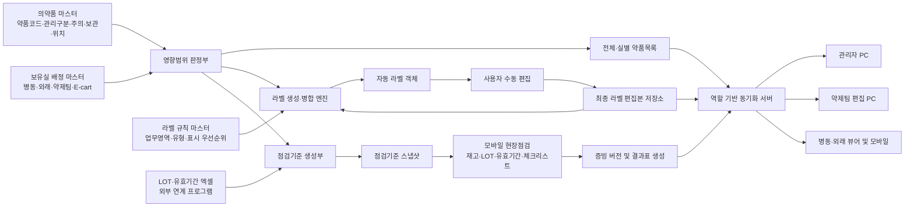
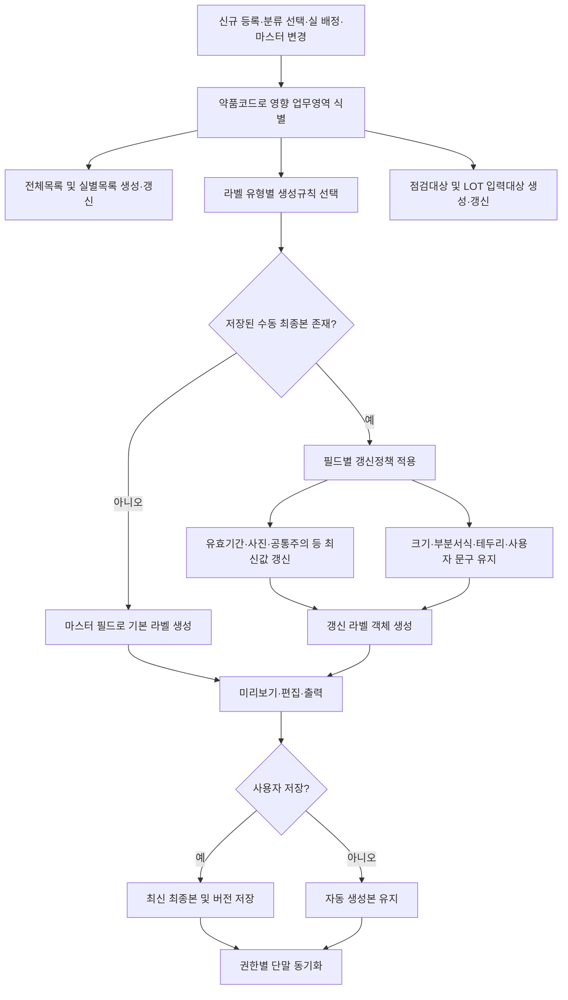
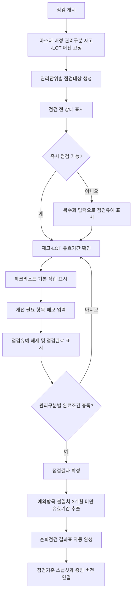

# 특허청구항 및 블록도

## 1. 발명의 명칭

**의약품 마스터의 관리구분 및 보유실 배정에 따른 업무객체 자동 생성, 라벨 편집본 보존 및 버전 고정형 점검을 수행하는 약제업무 통합 관리 시스템 및 그 방법**

## 2. 특허청구범위

### 【청구항 1】 독립항 — 통합 관리 시스템

의약품 재고, 라벨 및 점검업무를 통합하여 관리하는 약제업무 관리 시스템에 있어서,

약품코드를 식별자로 하고 의약품의 명칭, 함량, 제형, 관리구분, 주의정보, 보관조건, 위치정보 및 라벨 속성 중 적어도 하나를 포함하는 의약품 마스터 데이터, 상기 의약품과 병동, 외래, 약제팀 또는 응급카트 중 어느 하나의 관리단위 간의 보유실 배정관계, 라벨 유형별 생성규칙, 필드별 갱신정책, 사용자 편집에 의해 확정된 라벨 편집본 및 점검결과를 저장하는 데이터 저장부; 및

상기 데이터 저장부와 연결되고 명령어를 실행하는 하나 이상의 프로세서를 포함하고,

상기 하나 이상의 프로세서는,

상기 의약품 마스터 데이터의 등록 또는 변경, 상기 관리구분의 선택 또는 변경, 및 상기 보유실 배정관계의 등록 또는 변경 중 어느 하나의 데이터 변경 이벤트를 검출하고,

상기 약품코드, 상기 관리구분 및 상기 보유실 배정관계에 기초하여, 원내 전체 약품목록, 상기 관리단위별 약품목록, 라벨 출력대상 및 점검대상을 포함하는 서로 다른 업무영역의 파생 업무객체를 하나의 처리에서 생성 또는 갱신하며,

상기 라벨 출력대상에 대하여 업무영역 및 라벨 유형에 대응하는 상기 라벨 유형별 생성규칙을 선택하고, 상기 의약품 마스터 데이터의 필드를 상기 생성규칙의 표시영역에 배치하여 라벨 객체를 자동 생성하며,

상기 라벨 객체에 대한 사용자 편집을 입력받아 상기 라벨 편집본으로 저장하고,

상기 데이터 변경 이벤트가 상기 라벨 편집본의 저장 후 발생하는 경우, 상기 필드별 갱신정책에 따라 마스터 종속 필드는 변경된 의약품 마스터 데이터로 갱신하고 사용자 확정 필드는 상기 라벨 편집본의 값으로 유지하여 갱신 라벨 객체를 생성하며,

상기 파생 업무객체 및 상기 갱신 라벨 객체를 사용자 역할에 대응하는 단말기에 제공하는 것을 특징으로 하는 약제업무 관리 시스템.

### 【청구항 2】 종속항 — 공통 분류와 약제팀 전용 분류의 전파범위

청구항 1에 있어서,

상기 관리구분은 마약류, 향정신성의약품, 고위험의약품, 고가의약품, 항암제, 위해의약품, 냉장·냉동 의약품, 차광 의약품, 유사모양 의약품, 유사발음 의약품, 용량주의 의약품 및 의료기관 지정 집중관리 의약품 중 적어도 하나를 나타내고,

상기 하나 이상의 프로세서는,

병동, 외래, 약제팀 및 응급카트에 공통으로 적용되는 공통 관리구분과 약제팀 라벨에만 적용되는 약제팀 전용 라벨분류를 구분하여 저장하고,

상기 공통 관리구분의 변경은 병동 비품약, 비치 마약류, 응급카트 및 약제팀의 관련 목록·라벨·점검대상에 전파하되, 상기 약제팀 전용 라벨분류의 변경은 약제팀 라벨 및 약품장 목록에 한정하여 전파하는 것을 특징으로 하는 약제업무 관리 시스템.

### 【청구항 3】 종속항 — 라벨 규칙 매트릭스

청구항 1에 있어서,

상기 라벨 유형별 생성규칙은,

원병, PTP, ATC, 입원산제, 외용제, 외용점안제, 팩제, 시럽, 앰플, 바이알, 냉장주사, 영양수액, 일반수액, 마약류·향정신성의약품, 고가의약품 및 항암제 중 적어도 하나의 제형 또는 관리분류와,

약품명 라벨, 일반 측면라벨, 유색 측면라벨, 병뚜껑라벨, 유색 병뚜껑라벨, 선반라벨 및 약품장 전체목록 중 적어도 하나의 출력형식을 대응시키는 규칙 매트릭스를 포함하고,

상기 하나 이상의 프로세서는 상기 주의정보 및 보관조건의 조합에 따라 주의영역, 고위험영역, 차광영역, 냉장·냉동영역, 테두리, 글자색 및 배경색 중 적어도 하나의 표시 우선순위와 배치를 결정하는 것을 특징으로 하는 약제업무 관리 시스템.

### 【청구항 4】 종속항 — 수동 편집 최종본과 선택적 자동 갱신

청구항 1에 있어서,

상기 필드별 갱신정책은 라벨 객체의 필드를,

의약품 마스터 데이터 또는 보유실 배정관계에 따라 다시 산출되는 마스터 종속 필드;

사용자가 편집 후 확정하여 자동 갱신 시에도 유지되는 사용자 확정 필드; 및

변경 전 출력결과를 보존하는 이력 필드로 구분하고,

상기 마스터 종속 필드는 유효기간, 식별사진, 공통 주의정보 및 공통 보관정보 중 적어도 하나를 포함하고,

상기 사용자 확정 필드는 라벨 크기, 부착 위치, 약품 위치, ATC, 약품명 부분서식, 테두리 및 사용자 입력문구 중 적어도 하나를 포함하며,

상기 하나 이상의 프로세서는 동일 약품코드와 라벨 유형에 대응하는 복수의 라벨 편집본 중 최종 저장시각 또는 버전 식별정보에 의해 식별되는 최신 라벨 편집본을 검색, 미리보기 및 출력의 기본값으로 제공하는 것을 특징으로 하는 약제업무 관리 시스템.

### 【청구항 5】 종속항 — 식별사진 및 위치기반 약품장 라벨

청구항 1에 있어서,

상기 하나 이상의 프로세서는,

식별사진을 포함하는 라벨 유형에 대하여 약품코드 또는 함량과 제형 표현을 제거하여 정규화한 약품명을 외부 의약품 정보원 또는 로컬 이미지 저장소의 식별정보와 대조하고,

대조된 식별사진의 경로 및 출처정보를 상기 의약품 마스터 데이터 또는 라벨 객체에 연계하며,

상기 식별사진, 유효기간 및 ATC 정보를 측면라벨 또는 병뚜껑라벨의 서로 다른 표시영역에 자동 배치하고,

보관장소를 특정하는 위치 고유기호를 기준으로 해당 위치의 의약품을 추출·정렬하여 위치별 선반라벨 및 약품장 전체목록을 생성하는 것을 특징으로 하는 약제업무 관리 시스템.

### 【청구항 6】 종속항 — 역할 기반 다중 단말 동기화

청구항 1에 있어서,

상기 사용자 역할은 관리자, 편집자 및 읽기 전용 뷰어 중 적어도 하나를 포함하고,

상기 하나 이상의 프로세서는,

상기 사용자 역할에 따라 표시 화면, 수정 가능한 업무영역 및 서버 반영 권한을 구분하고,

모바일 단말과 복수의 PC 단말로부터 수신한 변경 데이터를 공용 서버의 상태 데이터와 약품코드를 기준으로 병합하며,

기준 리비전, 해시값, 수정시각 또는 클라이언트 식별정보 중 적어도 하나를 이용하여 오래된 상태에 의한 덮어쓰기를 검출하고,

편집 권한이 없는 뷰어에는 서버의 확정상태를 제공하고 편집 권한이 있는 단말의 변경은 관리자 승인 또는 자동 저장 정책에 따라 다른 단말기에 동기화하는 것을 특징으로 하는 약제업무 관리 시스템.

### 【청구항 7】 독립항 — 버전 고정형 현장 점검 시스템

의약품 재고 및 관리상태의 현장 점검을 처리하는 약제업무 점검 시스템에 있어서,

관리구분을 포함하는 의약품 마스터 데이터, 의약품과 관리단위 간의 보유실 배정관계, 외부 마약류 연계 프로그램에서 취득한 관리단위별 LOT 재고 데이터, 점검 체크리스트 및 점검결과를 저장하는 데이터 저장부; 및

상기 데이터 저장부와 연결되는 하나 이상의 프로세서를 포함하고,

상기 하나 이상의 프로세서는,

점검 개시명령에 응답하여 점검 개시 시점의 의약품 마스터 데이터, 보유실 배정관계, 관리구분, 전산재고 및 LOT 재고 데이터 중 적어도 하나의 값 또는 이를 재현할 수 있는 버전 식별정보를 포함하는 점검기준 스냅샷을 생성하고,

상기 점검기준 스냅샷에 기초하여 관리단위별 점검대상 목록을 생성하며,

일반 의약품에 대해서는 의약품별 실재고 및 유효기간 정보를 입력받고, 통제대상 의약품에 대해서는 LOT별 실재고 및 유효기간 정보를 입력받으며,

상기 관리구분에 따라 서로 다른 필수 입력항목 및 점검완료 조건을 적용하고,

상기 점검완료 조건이 충족된 경우 점검결과를 확정상태로 전환하여 상기 점검기준 스냅샷과 연계하고,

개선 필요 체크항목, 사용자 메모, 전산재고와 실재고의 불일치 및 기준기간 미만의 잔여 유효기간 중 적어도 하나를 추출하여 순회점검 결과표를 자동 생성하는 것을 특징으로 하는 약제업무 점검 시스템.

### 【청구항 8】 종속항 — 실별 LOT 엑셀 연계 및 대조

청구항 7에 있어서,

상기 하나 이상의 프로세서는,

외부 마약류 연계 프로그램에서 내려받은 엑셀자료의 보유실 식별정보, 약품 식별정보, LOT 식별정보, 사용기한 및 전산재고 수량을 미리 설정된 열 매핑규칙에 따라 상기 LOT 재고 데이터로 변환하고,

약품코드 매핑표 또는 약품명 매칭규칙을 이용하여 상기 LOT 재고 데이터를 상기 의약품 마스터 데이터 및 보유실 배정관계와 연결하며,

입력된 복수의 LOT별 실재고 수량을 합산하여 해당 통제대상 의약품의 총 실재고 수량을 산출하고,

상기 총 실재고 수량을 전산재고 수량과 비교하여 재고 차이 및 불일치 대상 LOT를 식별하는 것을 특징으로 하는 약제업무 점검 시스템.

### 【청구항 9】 종속항 — 점검 누락 표시와 결과표 자동 완성

청구항 7에 있어서,

상기 하나 이상의 프로세서는,

복수의 관리단위에 각각 대응하는 선택 객체를 점검 전, 점검유예 및 점검완료 상태에 따라 서로 다른 표시속성으로 화면에 출력하고,

점검이 곤란한 관리단위의 선택 객체에 대한 미리 설정된 복수회 입력을 수신하면 해당 관리단위를 점검유예 상태로 전환하며,

상기 관리단위의 재고 확인 또는 체크리스트 입력이 시작되면 상기 점검유예 상태를 해제하고 점검완료 상태로 전환하며,

상기 체크리스트의 적합 상태를 기본값으로 생성하고 개선 필요 상태 또는 메모가 입력된 항목만을 예외항목으로 추출하며,

상기 예외항목과 잔여 유효기간이 3개월 미만인 의약품의 식별정보 및 유효기간을 상기 순회점검 결과표에 자동 삽입하는 것을 특징으로 하는 약제업무 점검 시스템.

### 【청구항 10】 종속항 — 진행 중 점검의 기준 고정과 증빙 버전

청구항 7에 있어서,

상기 하나 이상의 프로세서는,

상기 점검기준 스냅샷이 생성된 후 의약품 마스터 데이터, 보유실 배정관계 또는 LOT 재고 데이터가 변경되더라도 진행 중인 점검에는 상기 점검기준 스냅샷을 유지하고,

변경된 데이터는 상기 진행 중인 점검의 기준을 변경하지 않고 이후 개시되는 점검에 적용하며,

점검자 정보, 점검일시, 관리단위, 관리구분, 전산재고, 실재고, LOT 정보, 불일치 정보, 체크리스트 예외항목 및 점검기준 스냅샷 식별정보 중 적어도 하나를 포함하는 점검 증빙정보를 생성하고,

확정된 점검결과를 정정하는 경우 기존 점검 증빙정보를 덮어쓰지 않고 새로운 증빙 버전으로 저장하는 것을 특징으로 하는 약제업무 점검 시스템.

### 【청구항 11】 독립항 — 통합 관리 방법

하나 이상의 프로세서에 의해 수행되는 의약품 재고, 라벨 및 점검업무의 통합 관리방법에 있어서,

약품코드를 식별자로 하고 관리구분, 주의정보, 보관조건, 위치정보 및 라벨 속성 중 적어도 하나를 포함하는 의약품 마스터 데이터를 저장하는 단계;

의약품을 병동, 외래, 약제팀 또는 응급카트 중 어느 하나의 관리단위에 배정하는 보유실 배정관계를 입력받는 단계;

상기 의약품 마스터 데이터의 등록·변경, 상기 관리구분의 선택·변경 또는 상기 보유실 배정관계의 등록·변경에 응답하여, 상기 약품코드를 기준으로 원내 전체 약품목록, 관리단위별 약품목록, 라벨 출력대상 및 점검대상을 하나의 처리에서 생성 또는 갱신하는 단계;

업무영역 및 라벨 유형에 대응하는 생성규칙을 선택하고, 상기 의약품 마스터 데이터의 필드를 상기 생성규칙에 따라 배치하여 라벨 객체를 자동 생성하는 단계;

상기 라벨 객체에 대한 사용자 편집을 입력받아 라벨 편집본으로 저장하는 단계;

상기 라벨 편집본 저장 후 상기 의약품 마스터 데이터 또는 보유실 배정관계가 변경되는 경우, 마스터 종속 필드는 변경된 데이터로 갱신하고 사용자 확정 필드는 상기 라벨 편집본의 값으로 유지하여 갱신 라벨 객체를 생성하는 단계;

점검 개시명령에 응답하여 점검 개시 시점의 의약품 마스터 데이터, 보유실 배정관계, 관리구분, 전산재고 및 LOT 재고 데이터 중 적어도 하나의 값 또는 버전 식별정보를 포함하는 점검기준 스냅샷을 생성하는 단계;

상기 점검기준 스냅샷과 관리구분에 따라 차등 설정된 입력항목 및 점검완료 조건을 적용하여 실재고 정보를 전산재고 정보와 대조하는 단계; 및

상기 점검완료 조건이 충족되면 점검결과를 상기 점검기준 스냅샷과 연계하여 저장하고 체크리스트의 예외항목 및 기준기간 미만의 유효기간 정보를 포함하는 순회점검 결과표를 자동 생성하는 단계를 포함하는 것을 특징으로 하는 약제업무 통합 관리방법.

### 【청구항 12】 종속항 — 라벨 최종본 및 점검 증빙의 이중 버전 관리

청구항 11에 있어서,

상기 갱신 라벨 객체를 생성하는 단계는,

라벨 객체의 필드를 마스터 종속 필드, 사용자 확정 필드 및 이력 필드로 구분하고,

상기 마스터 종속 필드를 변경된 의약품 마스터 데이터 또는 보유실 배정관계에 따라 갱신하며,

상기 사용자 확정 필드는 최종 저장된 사용자 편집값을 유지하고,

상기 이력 필드는 변경 전 라벨 객체를 삭제하지 않고 라벨 버전으로 보존하는 것을 포함하고,

상기 점검결과를 저장하는 단계는 확정된 점검결과에 증빙 버전 식별정보를 부여하고, 상기 점검결과가 정정되는 경우 기존 점검결과를 유지하면서 정정된 점검결과를 새로운 증빙 버전으로 저장하는 것을 특징으로 하는 약제업무 통합 관리방법.

## 3. 데이터 처리 블록도

## 4. 마스터 변경 및 라벨 병합 흐름도

## 5. 버전 고정형 점검 흐름도

