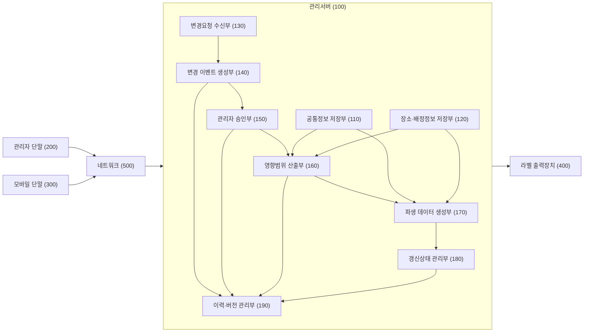
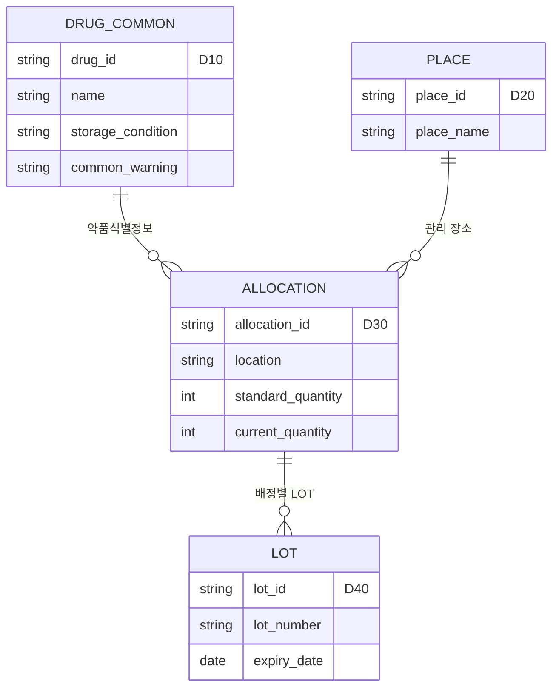
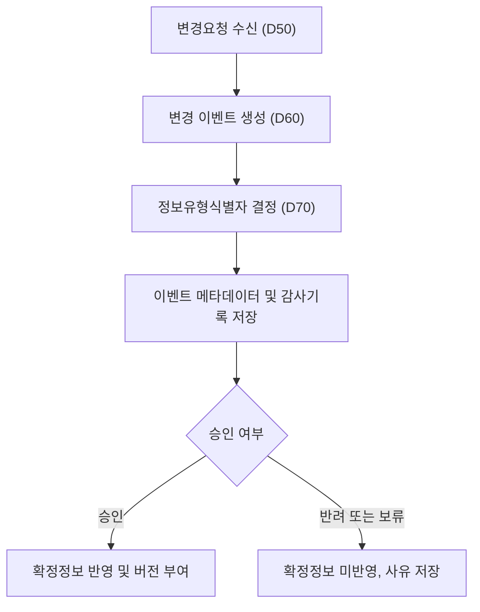
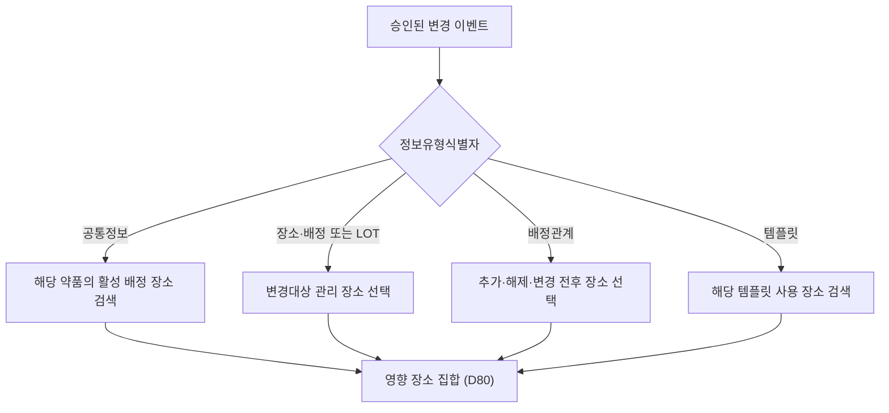
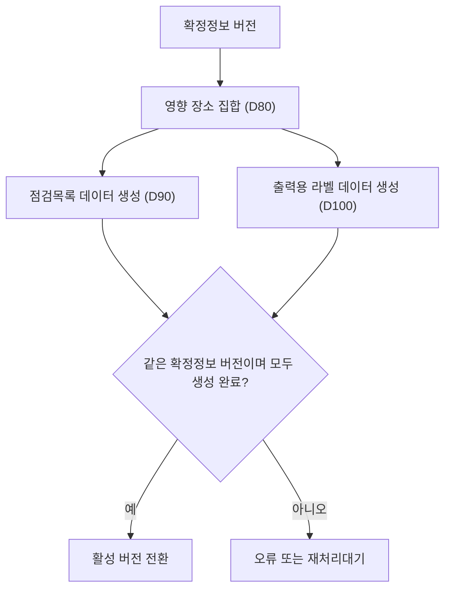
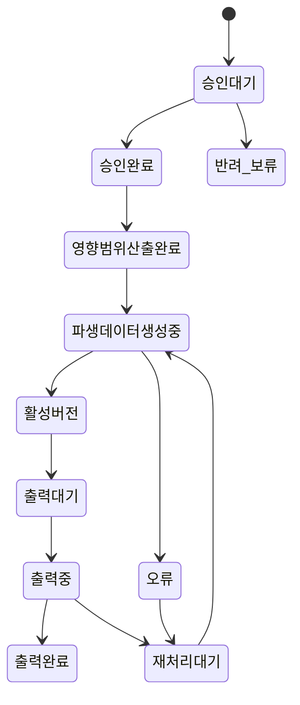
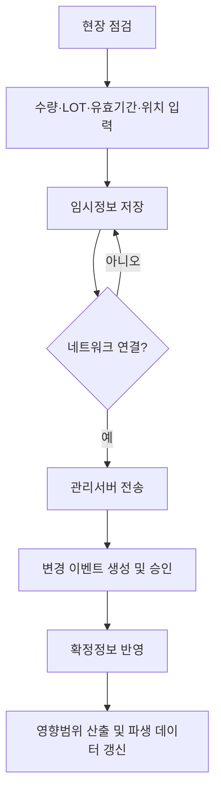
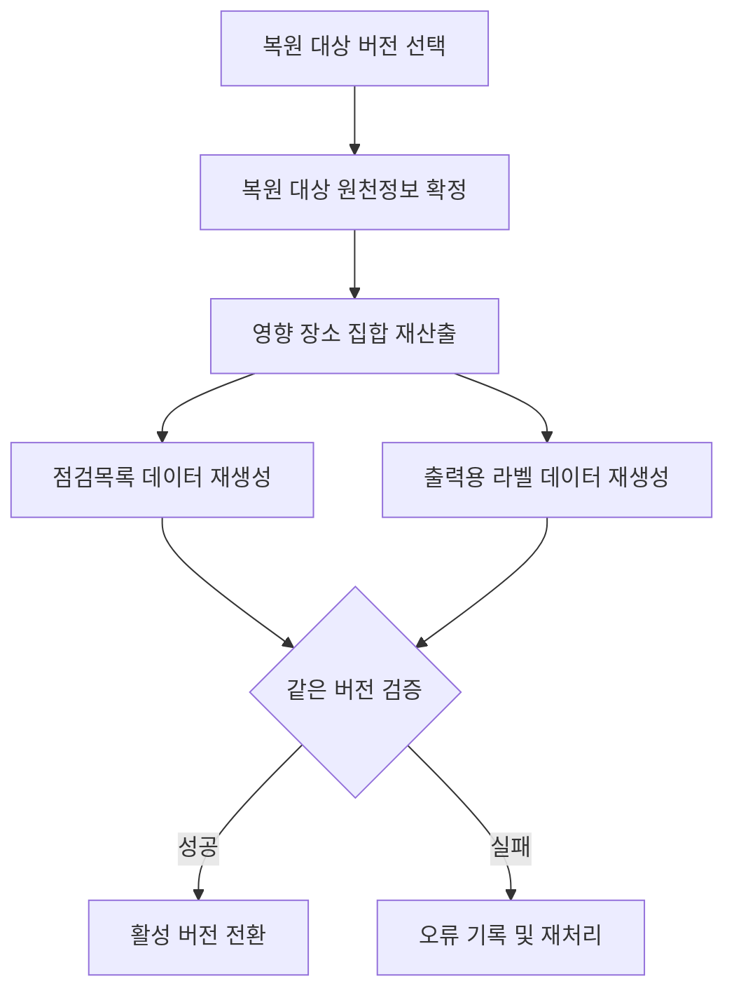
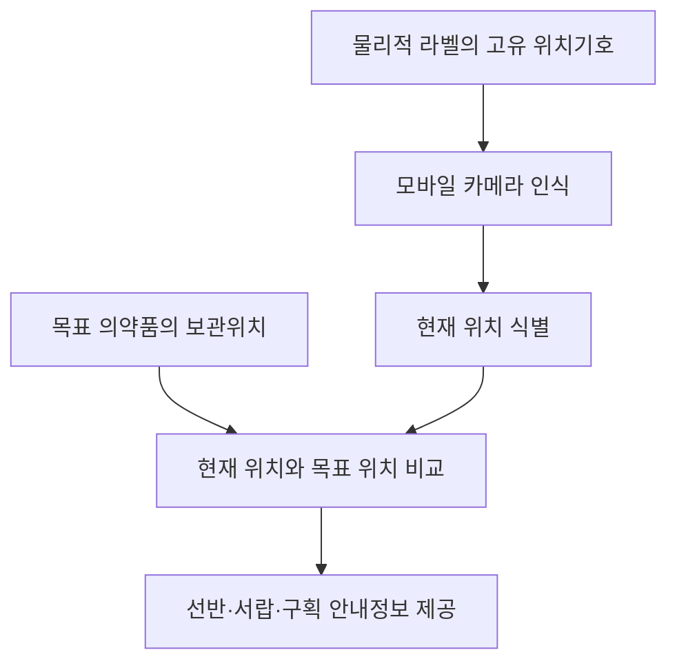

# 특허출원 명세서 B-1 수정본 - Markdown 전사 및 제출 준비 검토

> 원본: 특허출원 명세서_B_1 수정본.pdf (21쪽, 2026-08-11 확인)
>
> 이 문서는 원문 PDF를 텍스트로 전사한 뒤, 뒤에 구현 대조·출원 검토·제출용 도면 원고를 추가한 작업본입니다. 제출 전에는 본문을 특허로 명세서작성기에서 정식 서식으로 다시 작성해야 합니다.

---

<!-- 원문 PDF 1쪽 -->

1. 특허출원서【출원 구분】특허출원【출원인】성명 또는 법인명: 최윤영특허고객번호: 4-2026-061633-4주소: 경기도 고양시 일산 서구 대산로 142번지 우성 아파트 310-1406호국적: 대한민국【발명자】성명: 최윤영주소: 경기도 고양시 일산 서구 대산로 142번지 우성 아파트 310-1406호국적: 대한민국【발명의 국문 명칭】의약품 점검목록 및 보관위치 라벨의 연계 관리 시스템 및 그 방법【발명의 영문 명칭】SYSTEM AND METHOD FOR INTEGRATED MANAGEMENT OF MEDICATION INSPECTION LISTS AND STORAGE-LOCATION LABELS2. 명세서【발명의 설명】【발명의 명칭】의약품 점검목록 및 보관위치 라벨의 연계 관리 시스템 및 그 방법【기술분야】본 발명은 의료기관에서 보유하는 의약품의 점검 및 보관위치 표시를 관리하는 정보처리 기술에 관한 것이다.보다 구체적으로, 본 발명은 의약품에 공통적으로 적용되는 약품 공통정보와, 의료기관 내 관리 장소별로 상이하게 적용되는 배정정보, 위치정보, 수량정보, 로트번호 및 유효기간 등의 장소·배정정보를 구분하여 관리하고, 승인된 정보 변경에 대응하여 정보유형별 영향범위를 산출한 후, 영향받는 관리 장소의 의약품 점검목록 데이터와 물리적 라벨의 출력을 위한 출력용 라벨 데이터를 동일한 확정정보 버전에 기초하여 연계 갱신하는 시스템 및 그 방법에 관한 것이다.【발명의 배경이 되는 기술】의료기관에서는 병동, 약제부, 외래진료실, 수술실, 응급실, 응급카트, 검사실, 처치실, 창고 및 냉장보관구역 등의 복수의 관리 장소에 의약품을 분산하여 보관한다.각 관리 장소에서는 의약품의 명칭, 함량, 제형, 보관조건, 기준수량, 현재수량, 로트번호 및 유효기간 등을 확인하기 위한 점검목록을 운영할 수 있다. 또한 실제 의약품이 배치된 보관함, 서랍, 선반 또는 구획에는 의약품과 그 보관위치를 식별하기 위한 물리적 라벨이 부착될 수 있다.종래에는 점검목록과 보관위치 라벨이 각각 독립적으로 편집되거나 출력되는 경우가 많았다. 이에 따라 약품명, 함량 또는 공통 주의사항이 변경되었음에도 일부 장소의 점검목록 또는 라벨이 갱신되지 않거나, 특정 장소의 로트번호만 변경되었는데도 해당 약품을 보유한 모든 장

---

<!-- 원문 PDF 2쪽 -->

소의 자료를 다시 생성하여야 하는 문제가 있었다.또한 약품에 공통적으로 적용되는 정보와 장소별로 상이한 정보가 하나의 레코드에 혼재하거나 장소별 레코드마다 반복 저장되는 경우, 동일한 약품의 명칭, 보관조건 또는 주의사항이 장소별로 서로 다르게 남아 데이터 불일치가 발생할 수 있다.공통정보와 장소별 정보를 단순히 서로 다른 저장영역에 저장하는 것만으로는 변경된 정보가 어느 유형에 해당하는지, 변경에 의해 어느 관리 장소가 영향을 받는지, 어떠한 점검목록 및 라벨 데이터를 다시 생성하여야 하는지를 일관되게 판단하기 어렵다.특히 저장영역마다 정보유형을 나타내는 필드를 중복하여 저장하면 데이터 구조가 복잡해지고, 향후 새로운 정보유형이 추가될 때 원본 데이터의 스키마를 변경하여야 하는 문제가 발생할 수 있다.현장 점검 과정에서 모바일 단말을 이용하여 로트번호, 유효기간 또는 보관위치 등을 수정하는 경우에도 현장 입력정보가 즉시 확정정보에 반영되면, 미승인 정보가 점검목록 또는 라벨에 표시되는 위험이 있다.과거 버전으로 복원하는 경우 기존 점검목록 파일 또는 라벨 출력 파일만을 단순 복사하면, 복원된 원천정보와 현재의 장소 배정관계, 점검목록 데이터 및 라벨 데이터가 서로 일치하지 않을 수 있다.따라서 약품 공통정보와 장소·배정정보를 구조적으로 구분하면서도, 변경 이벤트의 정보유형, 승인 여부, 영향받는 관리 장소, 점검목록 데이터의 생성상태, 출력용 라벨 데이터의 생성 및 출력상태를 일관되게 추적할 수 있는 기술이 요구된다.【선행기술문헌】【특허문헌】특허문헌 1: 대한민국 등록특허공보 제10-2474131호, “전자종이 단말기를 활용한 병원물품 관리 시스템”특허문헌 2: 대한민국 등록특허공보 제10-1057022호, “병원물품 재고 관리 방법 및 그 시스템”【발명의 내용】【해결하려는 과제】본 발명이 해결하고자 하는 일 과제는 약품 공통정보와 관리 장소별로 변동되는 장소·배정정보를 구분하여 저장함으로써 공통정보의 중복 저장 및 장소별 데이터 불일치를 감소시키는 의약품 관리 시스템 및 그 방법을 제공하는 것이다.본 발명이 해결하고자 하는 다른 과제는 정보 변경에 대응하여 생성되는 변경 이벤트에 정보유형식별자를 메타데이터로 부여하고, 이를 변경 이벤트 로그 또는 감사기록에 유지함으로써 변경정보의 출처, 처리경로 및 영향범위를 추적할 수 있게 하는 것이다.본 발명이 해결하고자 하는 또 다른 과제는 정보유형식별자를 원본 약품정보의 필수 필드로 중복 저장하지 않고, 변경 이벤트의 메타데이터로 생성하여 저장구조의 중복을 줄이고 향후 새로운 정보유형의 추가에 대응할 수 있게 하는 것이다.본 발명이 해결하고자 하는 또 다른 과제는 약품 공통정보의 변경과 특정 장소의 장소·배정정

---

<!-- 원문 PDF 3쪽 -->

보 변경에 서로 다른 영향범위 산출규칙을 적용함으로써 불필요한 전체 자료의 재생성을 방지하는 것이다.본 발명이 해결하고자 하는 또 다른 과제는 승인된 변경에 의해 영향을 받는 관리 장소별로 점검목록 데이터와 출력용 라벨 데이터를 동일한 확정정보 버전에 기초하여 연계 생성하는 것이다.본 발명이 해결하고자 하는 또 다른 과제는 모바일 단말에서 입력된 현장 수정정보를 임시정보로 저장하고 관리자 승인 이후에만 확정정보 및 파생 데이터에 반영하는 것이다.본 발명이 해결하고자 하는 또 다른 과제는 과거 버전의 복원 시 원천정보뿐만 아니라 영향 장소 집합, 점검목록 데이터 및 출력용 라벨 데이터를 다시 산출하여 데이터 정합성을 확보하는 것이다.【과제의 해결 수단】본 발명의 일 실시예에 따른 의약품 점검목록 및 보관위치 라벨의 연계 관리 시스템은, 약품식별정보를 기준으로 복수의 관리 장소에 공통적으로 적용되는 약품 공통정보를 저장하는 공통정보 저장부와, 관리 장소, 약품과 관리 장소 사이의 배정관계, 보관위치, 수량, 로트번호 및 유효기간 중 적어도 하나를 포함하는 장소·배정정보를 저장하는 장소·배정정보 저장부를 포함할 수 있다.공통정보 저장부와 장소·배정정보 저장부는 서로 다른 물리적 저장장치로 구현되거나, 하나의 저장장치 또는 하나의 데이터베이스 내에서 서로 다른 테이블, 스키마, 컬렉션, 파티션 또는 논리적 저장영역으로 구분될 수 있다.시스템은 약품 공통정보 또는 장소·배정정보에 대한 변경요청을 수신하는 변경요청 수신부와, 변경요청에 대응하는 변경 이벤트를 생성하는 변경 이벤트 생성부를 포함할 수 있다.변경 이벤트 생성부는 변경대상이 속하는 저장영역, 데이터 스키마, 필드 경로, 입력화면, 응용프로그램 인터페이스, 변경명령 또는 대상 객체 중 적어도 하나를 기초로 정보유형식별자를 결정하여 변경 이벤트의 메타데이터로 기록할 수 있다.정보유형식별자는 원본 약품 공통정보 또는 원본 장소·배정정보의 필수 필드로 중복 저장되는 것이 아니라, 변경 이벤트의 분류, 영향범위 산출, 감사기록 검색, 승인경로 결정 및 추가 정보유형의 확장 처리를 위해 변경 이벤트 로그 또는 감사기록에 유지될 수 있다.시스템은 변경 이벤트를 승인, 반려 또는 보류 처리하는 관리자 승인부와, 승인된 변경 이벤트의 정보유형식별자 및 변경대상에 따라 영향 장소 집합을 산출하는 영향범위 산출부를 포함할 수 있다.영향범위 산출부는 약품 공통정보가 변경된 경우 해당 약품이 배정된 복수의 관리 장소를 영향 장소 집합으로 산출하고, 특정 장소의 장소·배정정보가 변경된 경우 해당 특정 장소를 영향 장소 집합으로 산출할 수 있다.시스템은 영향 장소 집합에 포함된 각 관리 장소에 대하여 점검목록 데이터와 물리적 라벨의 출력을 위한 출력용 라벨 데이터를 동일한 확정정보 버전에 기초하여 생성하는 파생 데이터 생성부를 포함할 수 있다.시스템은 점검목록 데이터와 출력용 라벨 데이터의 생성상태, 전송상태, 출력대기상태, 출력완

---

<!-- 원문 PDF 4쪽 -->

료상태 및 오류상태 중 적어도 하나를 연계하여 관리하는 갱신상태 관리부를 포함할 수 있다.시스템은 변경 이벤트, 승인정보, 확정정보 버전, 영향 장소 집합, 점검목록 데이터의 버전, 출력용 라벨 데이터의 버전 및 출력상태를 서로 연계하여 저장하는 이력·버전 관리부를 포함할 수 있다.과거 버전의 복원이 요청된 경우, 이력·버전 관리부는 복원 대상 원천정보를 확정한 후 영향범위를 다시 산출하고, 점검목록 데이터와 출력용 라벨 데이터를 재생성하도록 구성될 수 있다.【발명의 효과】본 발명에 따르면 약품 공통정보와 장소·배정정보를 물리적 또는 논리적으로 구분하여 저장함으로써 동일한 공통정보가 관리 장소별로 중복 저장되는 것을 줄일 수 있다.또한 정보유형식별자를 원본 약품정보의 중복 필드로 저장하지 않고 변경 이벤트의 메타데이터로 생성하므로, 저장소 분리에 따른 정보구조의 중복을 줄이면서도 변경 이벤트의 분류, 승인, 영향분석 및 감사추적이 가능하다.정보유형식별자가 변경 이벤트 로그 또는 감사기록에 유지되므로, 변경정보의 입력 출처, 변경 전후 값, 승인자, 적용된 영향범위 산출규칙 및 파생 데이터의 생성 결과를 사후에 확인할 수 있다.약품 공통정보 및 장소·배정정보 이외에 템플릿정보, 안전정보, 규제정보 또는 외부 연동정보가 추가되더라도 새로운 정보유형식별자와 처리규칙을 추가함으로써 시스템을 확장할 수 있다.약품 공통정보의 변경 시에는 해당 약품이 배정된 관리 장소들을 영향 장소로 산출하고, 특정 장소의 로트번호 또는 유효기간이 변경된 경우에는 해당 장소를 영향 장소로 산출하므로 불필요한 전체 자료의 재생성을 방지할 수 있다.점검목록 데이터와 출력용 라벨 데이터를 동일한 확정정보 버전에 기초하여 연계 생성함으로써 점검목록과 실제 보관위치에 부착되는 물리적 라벨 사이의 정보 불일치를 줄일 수 있다.현장 입력정보를 임시정보로 저장하고 관리자 승인 후 확정정보로 전환함으로써 미승인 정보가 점검목록 또는 라벨에 반영되는 것을 방지할 수 있다.과거 버전 복원 시 영향 장소 집합과 파생 데이터를 다시 산출함으로써 단순한 파일 복사 방식에서 발생할 수 있는 원천정보, 배정관계 및 출력 데이터 사이의 불일치를 감소시킬 수 있다.【도면의 간단한 설명】도 1은 본 발명의 일 실시예에 따른 의약품 점검목록 및 보관위치 라벨의 연계 관리 시스템의 전체 구성을 나타내는 블록도이다.도 2는 본 발명의 일 실시예에 따른 약품 공통정보와 장소·배정정보 사이의 데이터 관계를 나타내는 도면이다.도 3은 본 발명의 일 실시예에 따른 변경요청의 수신, 변경 이벤트의 생성 및 관리자 승인 과정을 나타내는 흐름도이다.

---

<!-- 원문 PDF 5쪽 -->

도 4는 본 발명의 일 실시예에 따른 정보유형식별자에 기초한 영향 장소 집합의 산출 과정을 나타내는 흐름도이다.도 5는 본 발명의 일 실시예에 따른 점검목록 데이터 및 출력용 라벨 데이터의 연계 생성 과정을 나타내는 흐름도이다.도 6은 본 발명의 일 실시예에 따른 갱신상태 및 출력상태의 전이를 나타내는 상태도이다.도 7은 본 발명의 일 실시예에 따른 모바일 단말의 현장 수정정보 처리 과정을 나타내는 흐름도이다.도 8은 본 발명의 일 실시예에 따른 과거 버전의 복원 및 파생 데이터 재구성 과정을 나타내는 흐름도이다.도 9는 본 발명의 일 실시예에 따른 고유 위치기호와 모바일 단말을 이용한 의약품 보관위치 안내 과정을 나타내는 도면이다.【발명을 실시하기 위한 구체적인 내용】이하, 첨부된 도면을 참조하여 본 발명의 실시예를 설명한다. 본 명세서에 기재된 실시예는 본 발명의 이해를 위한 것이며, 본 발명의 권리범위가 특정 실시예로 한정되는 것은 아니다.본 명세서에서 “포함한다” 또는 “구비한다”는 표현은 특별히 반대되는 기재가 없는 한 다른 구성요소를 더 포함할 수 있는 개방형 표현으로 해석된다.1. 용어의 정의본 명세서에서 “의약품”은 전문의약품, 일반의약품, 응급의약품, 마약류 의약품, 의약외품, 의료용 소모품 및 의료기관에서 점검목록과 보관위치 라벨을 이용하여 관리할 필요가 있는 물품 중 적어도 하나를 포함할 수 있다.“관리 장소”는 병동, 약제부, 외래진료실, 수술실, 응급실, 응급카트, 처치실, 검사실, 보관창고, 냉장보관구역, 보관함, 선반, 서랍 또는 구획 중 적어도 하나를 포함할 수 있다.“약품 공통정보”는 복수의 관리 장소에 공통으로 적용되는 정보로서 약품식별자, 약품명, 성분명, 함량, 제형, 제조사, 표준코드, 보관조건, 공통 주의사항, 외형정보 및 공통 표시문구 중 적어도 하나를 포함할 수 있다.“장소·배정정보”는 특정 약품과 특정 관리 장소 사이의 관계에 대응하는 정보로서 관리 장소 식별자, 배정 식별자, 보관위치, 기준수량, 현재수량, 로트번호, 유효기간, 장소별 주의문구, 정렬순서, 점검주기 및 라벨 템플릿 식별자 중 적어도 하나를 포함할 수 있다.“확정정보”는 관리자 승인 또는 미리 설정된 확정절차를 통과하여 점검목록 데이터 및 출력용 라벨 데이터의 생성에 사용될 수 있는 정보이다.“파생 데이터”는 약품 공통정보 및 장소·배정정보 중 적어도 하나를 이용하여 생성되는 점검목록 데이터 또는 출력용 라벨 데이터를 포함할 수 있다.“출력용 라벨 데이터”는 라벨 출력장치가 종이, 합성수지, 감열지, 접착성 라벨지 또는 그 밖의 물리적 매체에 라벨을 출력하기 위한 문자열, 이미지, 바코드, 이차원 코드, 고유 위치기

---

<!-- 원문 PDF 6쪽 -->

호, 출력서식 및 출력명령 중 적어도 하나를 포함할 수 있다.2. 시스템의 전체 구성도 1을 참조하면, 본 발명의 일 실시예에 따른 의약품 점검목록 및 보관위치 라벨의 연계 관리 시스템(10)은 관리서버(100), 관리자 단말(200), 모바일 단말(300), 라벨 출력장치(400) 및 네트워크(500)를 포함할 수 있다.관리서버(100)는 공통정보 저장부(110), 장소·배정정보 저장부(120), 변경요청 수신부(130), 변경 이벤트 생성부(140), 관리자 승인부(150), 영향범위 산출부(160), 파생 데이터 생성부(170), 갱신상태 관리부(180) 및 이력·버전 관리부(190)를 포함할 수 있다.각 기능 구성요소는 물리적으로 분리된 하드웨어로 구현되거나, 하나 이상의 프로세서에 의해 실행되는 소프트웨어 모듈로 구현될 수 있다. 복수의 기능 구성요소가 하나의 프로그램 모듈로 통합되거나 하나의 기능 구성요소가 복수의 프로그램 모듈로 분산 구현되는 경우도 본 발명의 범위에 포함된다.관리자 단말(200)은 PC, 노트북 또는 업무용 단말로 구현될 수 있다. 관리자 단말(200)은 약품 공통정보 및 장소·배정정보의 조회 또는 편집, 변경 이벤트의 승인 또는 반려, 점검목록의 조회 또는 출력, 라벨의 미리보기 및 출력명령을 수행할 수 있다.모바일 단말(300)은 스마트폰, 태블릿 컴퓨터 또는 휴대형 점검단말로 구현될 수 있다. 모바일 단말(300)은 현장 점검, 수량 확인, 로트번호 또는 유효기간의 입력, 보관위치 확인 및 변경요청 등록을 수행할 수 있다.라벨 출력장치(400)는 일반 프린터, 라벨 프린터, 감열식 프린터 또는 네트워크 프린터로 구현될 수 있다. 라벨 출력장치(400)는 출력용 라벨 데이터(D100)에 따라 물리적 라벨을 출력할 수 있다.3. 데이터 저장구조도 2를 참조하면, 공통정보 저장부(110)는 약품 공통정보(D10)를 저장할 수 있다.장소·배정정보 저장부(120)는 장소정보(D20), 배정정보(D30) 및 로트정보(D40) 중 적어도 하나를 저장할 수 있다.하나의 약품 공통정보(D10)는 복수의 배정정보(D30)와 연계될 수 있다. 하나의 관리 장소에는 복수의 약품이 배정될 수 있고, 하나의 약품은 복수의 관리 장소에 배정될 수 있다.하나의 배정정보(D30)에는 하나 이상의 로트정보(D40)가 연계될 수 있다. 동일한 약품이 동일한 관리 장소에 복수의 로트로 보관되는 경우, 각각의 로트별 수량과 유효기간을 별도로 관리할 수 있다.공통정보 저장부(110)와 장소·배정정보 저장부(120)는 서로 다른 물리적 데이터베이스로 구현될 수 있다.다른 실시예에서 공통정보 저장부(110)와 장소·배정정보 저장부(120)는 하나의 데이터베이스 내에서 서로 다른 테이블, 스키마, 컬렉션, 파티션 또는 논리적 저장영역으로 구분될 수 있다.따라서 “저장부가 구분된다”는 것은 물리적으로 서로 다른 저장장치에 저장되는 경우뿐만 아니라, 하나의 저장장치 내에서 데이터 모델 또는 접근영역이 논리적으로 구분되는 경우를 포

---

<!-- 원문 PDF 7쪽 -->

함한다.이러한 저장구조에 의해 약품명, 함량 및 공통 보관조건 등의 약품 공통정보를 각 관리 장소의 배정 레코드에 반복 저장하지 않으면서, 장소마다 상이한 로트번호, 유효기간, 수량 및 보관위치를 독립적으로 관리할 수 있다.4. 변경요청 및 변경 이벤트 생성도 3을 참조하면, 변경요청 수신부(130)는 관리자 단말(200), 모바일 단말(300) 또는 외부 시스템으로부터 변경요청 데이터(D50)를 수신할 수 있다.변경요청 데이터(D50)는 변경대상 식별정보, 변경 필드, 변경 전 값, 변경 후 값, 요청자 식별정보, 요청시각, 변경사유 및 입력 출처 중 적어도 하나를 포함할 수 있다.변경 이벤트 생성부(140)는 변경요청 데이터(D50)에 대응하는 변경 이벤트(D60)를 생성할 수 있다.변경 이벤트(D60)는 다음 정보 중 적어도 하나를 포함할 수 있다.이벤트 식별자변경대상 객체의 식별자변경 필드 또는 필드 경로변경 전 값변경 후 값요청자 식별정보요청시각입력 출처승인상태정보유형식별자(D70)적용 대상 버전상위 이벤트 또는 연계 이벤트 식별자변경 이벤트 생성부(140)는 변경대상이 속하는 저장영역, 대상 테이블, 데이터 스키마, 필드 경로, 수정이 이루어진 입력화면, 호출된 응용프로그램 인터페이스, 변경명령 또는 대상 객체의 종류 중 적어도 하나를 이용하여 정보유형식별자(D70)를 결정할 수 있다.정보유형식별자(D70)는 예를 들어 다음 중 어느 하나일 수 있다.약품 공통정보 유형장소·배정정보 유형로트정보 유형배정관계 유형템플릿정보 유형외부 연동정보 유형약품명, 성분명, 함량, 제형 또는 공통 주의사항의 변경은 약품 공통정보 유형으로 분류될 수 있다.특정 병동에 배정된 약품의 기준수량, 현재수량 또는 보관위치의 변경은 장소·배정정보 유형으로 분류될 수 있다.특정 장소에 보관된 약품의 로트번호 또는 유효기간의 변경은 로트정보 유형으로 분류될 수

---

<!-- 원문 PDF 8쪽 -->

있다.약품과 관리 장소 사이의 신규 배정, 배정 해제 또는 배정 장소의 변경은 배정관계 유형으로 분류될 수 있다.5. 정보유형식별자의 저장 및 기술적 의미정보유형식별자(D70)는 원본 약품 공통정보(D10), 장소정보(D20), 배정정보(D30) 또는 로트정보(D40)의 필수 필드로 반복 저장되지 않을 수 있다.정보유형식별자(D70)는 변경 이벤트(D60)의 메타데이터로 생성되고, 변경 이벤트 로그 또는 버전·감사기록(D120)에 저장될 수 있다.이에 따라 공통정보 저장부(110)와 장소·배정정보 저장부(120)가 이미 구조적으로 구분되어 있더라도, 각각의 원본 레코드에 별도의 정보유형 필드를 중복하여 저장할 필요가 없다.정보유형식별자(D70)는 다음 처리 중 적어도 하나에 사용될 수 있다.변경 이벤트의 분류관리자 승인경로의 결정영향범위 산출규칙의 선택파생 데이터 생성규칙의 선택감사기록의 검색오류 발생 시 처리경로의 재현새로운 정보유형 추가 시 확장규칙의 적용예를 들어 향후 의약품 규제정보 또는 안전정보가 별도의 저장부에 추가되더라도, 새로운 정보유형식별자와 대응하는 영향범위 산출규칙을 추가함으로써 기존 원본 데이터의 스키마를 변경하지 않고 확장할 수 있다.변경 이벤트 로그 또는 감사기록에 저장된 정보유형식별자를 이용하면 특정 기간 동안 발생한 공통정보 변경만 검색하거나, 특정 관리 장소에 영향을 준 장소·배정정보 변경만 추적할 수 있다.따라서 정보유형식별자는 단순한 데이터 분류 표시를 넘어 변경 이벤트와 영향분석, 승인 및 파생 데이터 갱신을 연결하는 처리 메타데이터로 기능할 수 있다.6. 관리자 승인관리자 승인부(150)는 변경 이벤트(D60)를 승인, 반려 또는 보류 처리할 수 있다.모바일 단말(300)에서 입력된 수정정보는 원칙적으로 변경요청 데이터(D50) 또는 임시정보로 저장되며, 관리자 승인 전에는 확정정보를 직접 변경하지 않을 수 있다.관리자 승인부(150)는 사용자 역할, 소속부서, 관리 장소, 약품 종류, 마약류 여부, 변경 필드, 정보유형식별자, 변경 전후 값의 차이 및 변경 중요도 중 적어도 하나에 따라 승인권한 또는 승인경로를 결정할 수 있다.승인된 변경 이벤트(D60)는 확정정보에 반영되고 새로운 확정정보 버전이 부여될 수 있다.반려된 변경 이벤트(D60)는 반려사유와 함께 버전·감사기록(D120)에 저장될 수 있으나, 확정정보, 점검목록 데이터(D90) 및 출력용 라벨 데이터(D100)에는 반영되지 않을 수 있다.

---

<!-- 원문 PDF 9쪽 -->

보류된 변경 이벤트(D60)는 추가 확인자료가 입력될 때까지 확정정보에 반영되지 않을 수 있다.7. 영향 장소 집합 산출도 4를 참조하면, 영향범위 산출부(160)는 승인된 변경 이벤트(D60)의 정보유형식별자(D70), 변경대상 식별자 및 약품과 관리 장소 사이의 배정관계를 이용하여 영향 장소 집합(D80)을 산출할 수 있다.7.1 약품 공통정보 변경정보유형식별자(D70)가 약품 공통정보 유형인 경우, 영향범위 산출부(160)는 변경 대상 약품과 활성 배정관계를 갖는 관리 장소를 검색할 수 있다.검색된 관리 장소들의 집합은 영향 장소 집합(D80)으로 산출될 수 있다.예를 들어 약품명, 함량, 제형, 보관조건 또는 공통 주의사항이 변경되면 해당 약품이 배정된 각 관리 장소의 점검목록 데이터(D90)와 출력용 라벨 데이터(D100)가 갱신대상이 될 수 있다.7.2 장소·배정정보 또는 로트정보 변경정보유형식별자(D70)가 장소·배정정보 유형 또는 로트정보 유형인 경우, 영향범위 산출부(160)는 변경대상인 배정정보(D30) 또는 로트정보(D40)가 속하는 특정 관리 장소를 영향 장소 집합(D80)에 포함시킬 수 있다.예를 들어 특정 병동의 로트번호 또는 유효기간이 변경된 경우 다른 병동의 점검목록 데이터와 출력용 라벨 데이터는 재생성 대상에서 제외될 수 있다.7.3 배정관계 변경정보유형식별자(D70)가 배정관계 유형인 경우, 영향범위 산출부(160)는 약품이 새로 배정되는 장소, 배정이 해제되는 장소, 변경 전 장소 및 변경 후 장소 중 적어도 하나를 영향 장소 집합(D80)에 포함시킬 수 있다.7.4 템플릿정보 변경정보유형식별자(D70)가 템플릿정보 유형인 경우, 영향범위 산출부(160)는 변경된 템플릿을 사용하는 관리 장소, 약품군 또는 라벨 종류를 검색하여 영향 장소 집합(D80)을 산출할 수 있다.이와 같이 정보유형에 따라 영향 장소 집합의 산출규칙을 다르게 적용함으로써 공통정보의 변경은 복수의 배정장소에 전파하고, 특정 장소의 정보 변경은 해당 장소에 한정하여 반영할 수 있다.8. 점검목록 데이터 및 출력용 라벨 데이터의 연계 생성도 5를 참조하면, 파생 데이터 생성부(170)는 영향 장소 집합(D80)에 포함된 각 관리 장소에 대하여 점검목록 데이터(D90) 및 출력용 라벨 데이터(D100)를 생성할 수 있다.점검목록 데이터(D90)는 약품명, 함량, 보관위치, 기준수량, 현재수량, 로트번호, 유효기간, 점검결과, 점검자 및 점검일시 중 적어도 하나를 포함할 수 있다.출력용 라벨 데이터(D100)는 약품명, 함량, 보관위치, 로트번호, 유효기간, 주의문구, 바코드, 이차원 코드, 고유 위치기호, 출력서식 및 출력매수 중 적어도 하나를 포함할 수 있다.

---

<!-- 원문 PDF 10쪽 -->

점검목록 데이터(D90)와 출력용 라벨 데이터(D100)는 동일한 확정정보 버전을 참조하여 생성될 수 있다.점검목록 데이터(D90)와 출력용 라벨 데이터(D100)에는 다음 정보 중 적어도 하나가 포함될 수 있다.확정정보 버전변경 이벤트 식별자장소 식별자약품 식별자생성시각템플릿 버전데이터 해시값파생 데이터 생성부(170)는 약품 공통정보(D10)와 장소·배정정보를 결합하여 관리 장소별 점검목록 데이터(D90) 및 출력용 라벨 데이터(D100)를 생성할 수 있다.예를 들어 특정 약품의 공통 약품명과 특정 병동의 로트번호를 결합하여 해당 병동용 점검목록 및 물리적 라벨의 출력 데이터를 생성할 수 있다.9. 갱신상태 및 출력상태 관리도 6을 참조하면, 갱신상태 관리부(180)는 점검목록 데이터(D90)와 출력용 라벨 데이터(D100)의 생성 및 출력 과정에 대응하는 갱신상태정보(D110)를 관리할 수 있다.갱신상태정보(D110)는 다음 상태 중 적어도 하나를 포함할 수 있다.변경요청승인대기승인완료영향범위 산출완료파생 데이터 생성중점검목록 데이터 생성완료출력용 라벨 데이터 생성완료활성 버전 전환출력대기출력중출력완료오류재처리대기갱신상태 관리부(180)는 점검목록 데이터(D90)와 출력용 라벨 데이터(D100)가 동일한 확정정보 버전에 기초하여 정상적으로 생성된 경우에 해당 버전을 활성 버전으로 전환할 수 있다.점검목록 데이터(D90)와 출력용 라벨 데이터(D100) 중 어느 하나의 생성에 실패한 경우, 갱신상태 관리부(180)는 해당 버전을 활성 버전으로 전환하지 않고 오류상태 또는 재처리대기상태로 유지할 수 있다.점검목록 데이터(D90)와 출력용 라벨 데이터(D100)에 서로 다른 확정정보 버전이 부여된 경우, 갱신상태 관리부(180)는 버전 불일치 상태를 생성하고 관리자 단말(200)에 경고정보를 제공할 수 있다.

---

<!-- 원문 PDF 11쪽 -->

출력용 라벨 데이터(D100)는 출력대기열에 등록될 수 있다. 출력대기열에는 출력 요청자, 출력 대상 장소, 출력매수, 라벨 출력장치 식별자, 출력상태, 출력시각 및 재출력 사유 중 적어도 하나가 기록될 수 있다.10. 이력 및 버전 복원이력·버전 관리부(190)는 버전·감사기록(D120)을 저장할 수 있다.버전·감사기록(D120)은 다음 정보 중 적어도 하나를 포함할 수 있다.변경 이벤트정보유형식별자변경 전후 값요청자 및 승인자요청시각 및 승인시각영향 장소 집합확정정보 버전점검목록 데이터의 버전출력용 라벨 데이터의 버전출력상태복원 대상 버전복원 사유도 8을 참조하면, 과거 버전의 복원이 요청된 경우 관리서버(100)는 복원 대상 원천정보를 확정할 수 있다.관리서버(100)는 기존 점검목록 파일 또는 기존 라벨 출력 파일만을 복사하는 대신, 복원된 원천정보를 기준으로 영향범위 산출부(160)를 다시 실행하여 영향 장소 집합(D80)을 재산출할 수 있다.파생 데이터 생성부(170)는 재산출된 영향 장소 집합(D80)에 대하여 점검목록 데이터(D90) 및 출력용 라벨 데이터(D100)를 다시 생성할 수 있다.복원 과정에서 적용되는 장소 배정관계는 복원 대상 시점의 배정관계 또는 복원 실행 시점의 유효한 배정관계 중 미리 설정된 복원 기준에 따라 결정될 수 있다.이에 따라 복원된 원천정보와 장소 배정관계, 점검목록 데이터 및 출력용 라벨 데이터 사이의 정합성이 유지될 수 있다.11. 모바일 현장 점검도 7을 참조하면, 모바일 단말(300)은 관리 장소에 부착된 장소코드, 보관함 코드 또는 약품 코드를 인식하여 해당 관리 장소의 점검목록을 호출할 수 있다.현장 사용자는 모바일 단말(300)을 통해 현재수량, 로트번호, 유효기간, 보관위치, 점검결과, 이상내용, 사진 및 수정사유 중 적어도 하나를 입력할 수 있다.모바일 단말(300)에서 입력된 정보는 변경요청 데이터(D50) 또는 임시정보로 저장될 수 있다.네트워크 연결이 불가능한 경우, 변경요청 데이터(D50)는 모바일 단말(300)에 임시저장된 후 네트워크가 복구되면 관리서버(100)로 전송될 수 있다.

---

<!-- 원문 PDF 12쪽 -->

관리서버(100)는 모바일 단말(300)로부터 수신한 변경요청 데이터(D50)에 대응하는 변경 이벤트(D60)를 생성하고 관리자 승인 절차를 수행할 수 있다.복수의 사용자가 동일한 데이터를 수정한 경우, 관리서버(100)는 기준 버전, 최종 수정시각 또는 변경 이벤트 식별자를 비교하여 수정 충돌을 검출할 수 있다.수정 충돌이 검출된 변경요청 데이터(D50)는 자동으로 확정되지 않고 관리자 확인 대상으로 분류될 수 있다.12. 보관위치 안내도 9를 참조하면, 관리 장소, 보관함, 선반, 서랍 또는 구획에는 고유 위치기호가 부여될 수 있다.고유 위치기호는 QR코드, 바코드, 문자코드 또는 영상 마커 중 적어도 하나로 구성될 수 있으며, 출력용 라벨 데이터(D100)에 포함되어 물리적 라벨에 출력될 수 있다.모바일 단말(300)은 카메라를 통해 고유 위치기호를 인식하고, 인식된 현재 위치와 목표 의약품의 보관위치를 비교하여 위치 안내정보를 제공할 수 있다.위치 안내정보는 선반번호, 서랍번호, 구획번호, 방향표시, 거리정보 또는 카메라 영상에 중첩되는 안내표시 중 적어도 하나를 포함할 수 있다.이러한 위치 안내기능은 표시장치가 부착된 라벨을 원격으로 변경하거나 점멸시키는 구조에 한정되지 않고, 물리적 라벨에 출력된 고유 위치기호와 모바일 단말(300)의 영상인식 기능을 이용하여 구현될 수 있다.13. 컴퓨터 구현본 발명의 실시예에 따른 방법은 프로세서에 의해 실행 가능한 명령어를 포함하는 프로그램으로 구현될 수 있다.프로그램은 서버, PC, 모바일 단말, 클라우드 컴퓨팅 환경 또는 이들의 조합에서 실행될 수 있다.프로그램은 하드디스크, 솔리드 스테이트 드라이브, 플래시메모리, 광기록매체, 자기기록매체 및 그 밖의 비일시적 컴퓨터 판독가능 기록매체에 저장될 수 있다.본 발명의 각 처리단계는 반드시 기재된 순서에 따라 실행될 필요는 없으며, 기술적으로 가능한 범위에서 일부 단계가 병렬로 실행되거나 순서가 변경될 수 있다.【부호의 설명】시스템 및 기능 구성요소10: 의약품 점검목록 및 보관위치 라벨의 연계 관리 시스템100: 관리서버110: 공통정보 저장부120: 장소·배정정보 저장부130: 변경요청 수신부140: 변경 이벤트 생성부150: 관리자 승인부

---

<!-- 원문 PDF 13쪽 -->

160: 영향범위 산출부170: 파생 데이터 생성부180: 갱신상태 관리부190: 이력·버전 관리부200: 관리자 단말300: 모바일 단말400: 라벨 출력장치500: 네트워크데이터 객체D10: 약품 공통정보D20: 장소정보D30: 배정정보D40: 로트정보D50: 변경요청 데이터D60: 변경 이벤트D70: 정보유형식별자D80: 영향 장소 집합D90: 점검목록 데이터D100: 출력용 라벨 데이터D110: 갱신상태정보D120: 버전·감사기록3. 특허청구범위【청구항 1】의약품 점검목록 및 보관위치 라벨의 연계 관리 시스템에 있어서,약품식별정보를 기준으로 복수의 관리 장소에 공통적으로 적용되는 약품 공통정보를 저장하는 공통정보 저장부;상기 관리 장소, 상기 약품식별정보와 상기 관리 장소 사이의 배정관계, 보관위치, 수량, 로트번호 및 유효기간 중 적어도 하나를 포함하는 장소·배정정보를 저장하되, 상기 공통정보 저장부와 물리적 또는 논리적으로 구분되는 장소·배정정보 저장부;상기 약품 공통정보 또는 상기 장소·배정정보에 대한 변경요청을 수신하는 변경요청 수신부;상기 변경요청에 대응하는 변경 이벤트를 생성하고, 변경대상이 속하는 저장영역, 데이터 스키마, 필드 경로, 입력화면, 응용프로그램 인터페이스 및 대상 객체 중 적어도 하나에 기초하여 결정된 정보유형식별자를 상기 변경 이벤트의 메타데이터로 부여하는 변경 이벤트 생성부;상기 변경 이벤트에 대한 승인 여부를 처리하는 관리자 승인부;승인된 상기 변경 이벤트의 정보유형식별자 및 변경대상에 기초하여, 상기 약품 공통정보의 변경인 경우에는 해당 약품이 배정된 복수의 관리 장소를 포함하고, 특정 관리 장소의 장소·배정정보의 변경인 경우에는 해당 특정 관리 장소를 포함하는 영향 장소 집합을 산출하는 영향범위 산출부;상기 영향 장소 집합에 포함된 관리 장소별로, 동일한 확정정보 버전에 기초하는 점검목록 데이터 및 물리적 라벨의 출력을 위한 출력용 라벨 데이터를 생성하는 파생 데이터 생성부; 및상기 점검목록 데이터 및 상기 출력용 라벨 데이터의 생성상태와 상기 출력용 라벨 데이터의

---

<!-- 원문 PDF 14쪽 -->

출력상태를 서로 연계하여 관리하는 갱신상태 관리부;를 포함하는 의약품 점검목록 및 보관위치 라벨의 연계 관리 시스템.【청구항 2】청구항 1에 있어서,상기 공통정보 저장부와 상기 장소·배정정보 저장부는 서로 다른 물리적 저장장치, 하나의 데이터베이스 내의 서로 다른 테이블, 서로 다른 스키마, 서로 다른 컬렉션, 서로 다른 파티션 및 서로 다른 논리적 저장영역 중 어느 하나에 의해 구분되는 의약품 점검목록 및 보관위치 라벨의 연계 관리 시스템.【청구항 3】청구항 1에 있어서,상기 정보유형식별자는 상기 약품 공통정보 또는 상기 장소·배정정보의 원본 레코드에 필수 필드로 저장되지 않고, 상기 변경 이벤트의 분류, 영향범위 산출 및 감사추적을 위한 메타데이터로서 변경 이벤트 로그 또는 감사기록에 저장되는 의약품 점검목록 및 보관위치 라벨의 연계 관리 시스템.【청구항 4】청구항 1에 있어서,상기 정보유형식별자는 약품 공통정보 유형, 장소·배정정보 유형, 로트정보 유형, 배정관계 유형, 템플릿정보 유형 및 외부 연동정보 유형 중 적어도 하나를 포함하는 의약품 점검목록 및 보관위치 라벨의 연계 관리 시스템.【청구항 5】청구항 1에 있어서,상기 영향범위 산출부는,상기 정보유형식별자가 약품 공통정보 유형인 경우 해당 약품식별정보와 활성 배정관계를 갖는 관리 장소들의 집합을 상기 영향 장소 집합으로 산출하고,상기 정보유형식별자가 장소·배정정보 유형 또는 로트정보 유형인 경우 변경대상인 배정정보 또는 로트정보가 속하는 관리 장소를 상기 영향 장소 집합으로 산출하는 의약품 점검목록 및 보관위치 라벨의 연계 관리 시스템.【청구항 6】청구항 1에 있어서,상기 영향범위 산출부는 약품과 관리 장소 사이의 배정관계가 추가, 해제 또는 변경된 경우, 추가 대상 장소, 해제 대상 장소, 변경 전 장소 및 변경 후 장소 중 적어도 하나를 상기 영향 장소 집합에 포함시키는 의약품 점검목록 및 보관위치 라벨의 연계 관리 시스템.【청구항 7】청구항 1에 있어서,

---

<!-- 원문 PDF 15쪽 -->

상기 관리자 승인부는 사용자 역할, 소속부서, 관리 장소, 약품 종류, 변경 필드, 정보유형식별자 및 변경 중요도 중 적어도 하나에 따라 승인권한 또는 승인경로를 결정하는 의약품 점검목록 및 보관위치 라벨의 연계 관리 시스템.【청구항 8】청구항 1에 있어서,상기 갱신상태 관리부는 상기 점검목록 데이터와 상기 출력용 라벨 데이터가 동일한 확정정보 버전에 기초하여 정상적으로 생성된 경우 해당 버전을 활성 버전으로 전환하는 의약품 점검목록 및 보관위치 라벨의 연계 관리 시스템.【청구항 9】청구항 1에 있어서,상기 갱신상태 관리부는 상기 출력용 라벨 데이터에 대하여 출력대기, 출력중, 출력완료, 출력오류 및 재출력대기 중 적어도 하나의 상태를 관리하는 의약품 점검목록 및 보관위치 라벨의 연계 관리 시스템.【청구항 10】청구항 1에 있어서,변경 이벤트, 승인정보, 확정정보 버전, 영향 장소 집합, 점검목록 데이터의 버전, 출력용 라벨 데이터의 버전 및 출력상태를 연계하여 저장하는 이력·버전 관리부를 더 포함하고,상기 이력·버전 관리부는 과거 버전의 복원 요청에 대응하여 복원 대상 원천정보를 설정한 후 상기 영향범위 산출부 및 상기 파생 데이터 생성부를 실행시켜 영향 장소 집합, 점검목록 데이터 및 출력용 라벨 데이터를 재구성하는 의약품 점검목록 및 보관위치 라벨의 연계 관리 시스템.【청구항 11】청구항 1에 있어서,현장 사용자의 모바일 단말로부터 수량, 로트번호, 유효기간, 보관위치 및 점검결과 중 적어도 하나에 대한 수정정보를 수신하고,상기 수정정보를 승인 전 임시정보로 저장하며,상기 관리자 승인부의 승인 후에 상기 수정정보를 확정정보에 반영하는 의약품 점검목록 및 보관위치 라벨의 연계 관리 시스템.【청구항 12】청구항 1에 있어서,상기 출력용 라벨 데이터는 관리 장소에 대응하는 고유 위치기호를 포함하고,모바일 단말의 카메라에 의해 인식된 고유 위치기호와 목표 의약품의 보관위치를 비교하여 위치 안내정보를 제공하는 의약품 점검목록 및 보관위치 라벨의 연계 관리 시스템.【청구항 13】

---

<!-- 원문 PDF 16쪽 -->

청구항 1에 있어서,상기 출력용 라벨 데이터는 약품명, 함량, 보관위치, 로트번호, 유효기간, 주의문구, 바코드, 이차원 코드 및 고유 위치기호 중 적어도 하나와, 라벨 출력장치가 물리적 매체에 출력하기 위한 출력서식을 포함하는 의약품 점검목록 및 보관위치 라벨의 연계 관리 시스템.【청구항 14】컴퓨터에 의해 수행되는 의약품 점검목록 및 보관위치 라벨의 연계 관리 방법에 있어서,약품식별정보를 기준으로 복수의 관리 장소에 공통적으로 적용되는 약품 공통정보와, 관리 장소별 배정관계, 보관위치, 수량, 로트번호 및 유효기간 중 적어도 하나를 포함하는 장소·배정정보를 물리적 또는 논리적으로 구분하여 저장하는 단계;상기 약품 공통정보 또는 상기 장소·배정정보에 대한 변경요청을 수신하는 단계;상기 변경요청에 대응하는 변경 이벤트를 생성하고, 변경대상이 속하는 저장영역, 데이터 스키마, 필드 경로, 입력화면, 응용프로그램 인터페이스 및 대상 객체 중 적어도 하나에 기초하여 정보유형식별자를 결정하여 상기 변경 이벤트의 메타데이터로 부여하는 단계;상기 변경 이벤트에 대한 관리자 승인을 처리하는 단계;승인된 상기 변경 이벤트의 정보유형식별자 및 변경대상에 기초하여 영향 장소 집합을 산출하는 단계;상기 영향 장소 집합에 포함된 관리 장소별로 동일한 확정정보 버전에 기초하는 점검목록 데이터와 물리적 라벨의 출력을 위한 출력용 라벨 데이터를 생성하는 단계; 및상기 점검목록 데이터의 생성상태와 상기 출력용 라벨 데이터의 생성상태 및 출력상태를 서로 연계하여 관리하는 단계;를 포함하는 의약품 점검목록 및 보관위치 라벨의 연계 관리 방법.【청구항 15】청구항 14에 있어서,상기 정보유형식별자는 원본 약품 공통정보 또는 원본 장소·배정정보의 필수 필드와 구분되어 변경 이벤트 로그 또는 감사기록에 저장되는 의약품 점검목록 및 보관위치 라벨의 연계 관리 방법.【청구항 16】청구항 14에 있어서,상기 영향 장소 집합을 산출하는 단계는,상기 변경 이벤트가 약품 공통정보의 변경을 나타내는 경우 해당 약품이 배정된 복수의 관리 장소를 상기 영향 장소 집합에 포함시키는 단계; 및상기 변경 이벤트가 특정 관리 장소의 장소·배정정보 또는 로트정보의 변경을 나타내는 경우 해당 특정 관리 장소를 상기 영향 장소 집합에 포함시키는 단계;

---

<!-- 원문 PDF 17쪽 -->

를 포함하는 의약품 점검목록 및 보관위치 라벨의 연계 관리 방법.【청구항 17】청구항 14에 있어서,상기 점검목록 데이터와 상기 출력용 라벨 데이터가 동일한 확정정보 버전에 기초하여 정상적으로 생성된 경우 해당 버전을 활성 버전으로 전환하고,상기 점검목록 데이터와 상기 출력용 라벨 데이터 중 어느 하나의 생성에 실패한 경우 해당 버전을 오류상태 또는 재처리대기상태로 유지하는 의약품 점검목록 및 보관위치 라벨의 연계 관리 방법.【청구항 18】청구항 14에 있어서,모바일 단말에서 입력된 현장 수정정보를 임시정보로 저장하는 단계;상기 현장 수정정보에 대응하는 변경 이벤트를 생성하는 단계; 및관리자 승인 후 상기 현장 수정정보를 확정정보에 반영하는 단계;를 더 포함하는 의약품 점검목록 및 보관위치 라벨의 연계 관리 방법.【청구항 19】청구항 14에 있어서,과거 버전의 복원 요청을 수신하는 단계;복원 대상 원천정보를 확정하는 단계;상기 복원 대상 원천정보에 대응하는 영향 장소 집합을 다시 산출하는 단계; 및다시 산출된 영향 장소 집합에 대하여 점검목록 데이터와 출력용 라벨 데이터를 재생성하는 단계;를 더 포함하는 의약품 점검목록 및 보관위치 라벨의 연계 관리 방법.【청구항 20】컴퓨터로 하여금 청구항 14 내지 청구항 19 중 어느 한 항에 따른 방법을 수행하게 하는 명령어를 포함하는 프로그램이 기록된 비일시적 컴퓨터 판독가능 기록매체.4. 요약서【요약】본 발명은 의약품 점검목록 및 보관위치 라벨의 연계 관리 시스템 및 그 방법에 관한 것이다. 시스템은 약품 공통정보와 장소별 배정관계, 보관위치, 수량, 로트번호 및 유효기간을 포함하는 장소·배정정보를 물리적 또는 논리적으로 구분하여 저장한다. 변경요청이 수신되면 변경 이벤트를 생성하고, 변경대상이 속하는 저장영역, 데이터 스키마, 필드 경로 또는 입력 출처 등에 따라 결정된 정보유형식별자를 변경 이벤트의 메타데이터로 기록한다. 승인된 변경 이벤

---

<!-- 원문 PDF 18쪽 -->

트에 대하여 정보유형별 영향 장소 집합을 산출하고, 영향받는 관리 장소별 점검목록 데이터와 물리적 라벨의 출력을 위한 출력용 라벨 데이터를 동일한 확정정보 버전에 기초하여 생성한다. 시스템은 두 파생 데이터의 생성상태 및 라벨 출력상태를 연계 관리하고, 과거 버전의 복원 시 영향 장소 집합과 파생 데이터를 재구성한다.【대표도】도 15. 도면 제출용 작성원고【도 1】 시스템 전체 구성도도 1에는 다음 구성을 배치한다.중앙: 관리서버(100)관리서버 내부:공통정보 저장부(110)장소·배정정보 저장부(120)변경요청 수신부(130)변경 이벤트 생성부(140)관리자 승인부(150)영향범위 산출부(160)파생 데이터 생성부(170)갱신상태 관리부(180)이력·버전 관리부(190)관리서버 외부:관리자 단말(200)모바일 단말(300)라벨 출력장치(400)네트워크(500)연결관계는 다음과 같이 표시한다.Copy관리자 단말(200) ─┐모바일 단말(300) ─┼─ 네트워크(500) ─ 관리서버(100)라벨 출력장치(400) ┘대표도는 도 1로 한다.【도 2】 데이터 관계도Copy약품 공통정보(D10)        │        │ 1:N        ▼배정정보(D30) ─── N:1 ─── 장소정보(D20)        │        │ 1:N        ▼로트정보(D40)공통정보 저장부(110)와 장소·배정정보 저장부(120)를 점선 또는 별도의 영역으로 구분한다.【도 3】 변경 이벤트 및 승인 흐름도Copy변경요청 수신

---

<!-- 원문 PDF 19쪽 -->

↓변경 이벤트 생성      ↓정보유형식별자 결정      ↓이벤트 메타데이터 기록      ↓관리자 승인 여부 판단   ┌──┴──┐ 승인     반려 또는 보류  ↓            ↓확정정보 반영   감사기록 저장【도 4】 영향 장소 집합 산출 흐름도Copy승인된 변경 이벤트        ↓정보유형식별자 판단 ┌──────┼──────────┬─────────┐공통정보  장소·배정/로트  배정관계  템플릿   ↓          ↓           ↓        ↓전체 배정장소 특정 장소   전후 장소  사용 장소 └───────────┬─────────────────┘             ↓      영향 장소 집합(D80)【도 5】 파생 데이터 연계 생성도Copy확정정보 버전      ↓영향 장소 집합(D80)      ↓ ┌────┴─────────┐ ↓              ↓점검목록 데이터    출력용 라벨 데이터   (D90)            (D100) └────┬─────────┘      ↓동일 확정정보 버전 검증      ↓활성 버전 전환【도 6】 갱신상태 및 출력상태도Copy변경요청  ↓승인대기  ↓승인완료  ↓영향범위 산출완료  ↓파생 데이터 생성중  ↓점검목록 및 라벨 데이터 생성완료

---

<!-- 원문 PDF 20쪽 -->

↓활성 버전 전환  ↓출력대기 → 출력중 → 출력완료   └──── 오류 → 재처리대기【도 7】 모바일 현장 수정 흐름도Copy현장 점검  ↓모바일 수정정보 입력  ↓임시저장  ↓관리서버 전송  ↓변경 이벤트 생성  ↓관리자 승인  ↓확정정보 반영  ↓영향 장소 산출 및 파생 데이터 갱신【도 8】 과거 버전 복원 흐름도Copy복원 대상 버전 선택       ↓복원 대상 원천정보 확정       ↓영향 장소 집합 재산출       ↓점검목록 데이터 재생성       ↓출력용 라벨 데이터 재생성       ↓동일 버전 검증       ↓활성 버전 전환【도 9】 보관위치 안내도Copy물리적 라벨의 고유 위치기호              ↓       모바일 카메라 인식              ↓현재 위치와 목표 의약품 보관위치 비교              ↓선반·서랍·구획 위치 안내6. 최종 제출 전 필수 입력·검증사항본 문안에서 법률적·기술적 내용은 제출본 형태로 정리되었으며, 실제 출원을 위해서는 다음 사항만 확정하면 됩니다.출원인 성명·주소·특허고객번호발명자 성명·주소

---

<!-- 원문 PDF 21쪽 -->

공동발명자 유무출원인과 발명자가 다른 경우 특허받을 수 있는 권리의 승계관계실제 시스템의 화면, 데이터베이스 구조 또는 라벨 예시와 명세서 내용의 일치 여부출원 전 제품 공개·시연·판매·제안서 배포 여부정식 선도면 9매 제작특허로 입력 후 문단번호·도면부호 자동검사발명의 영문 명칭 및 출원인 영문명 확인심사청구 동시 진행 여부

---

# 검토 및 제출 준비 자료

## 1. 검토 범위와 결론

이 검토는 원본 명세서, 현재 저장소의 구현 및 데이터 흐름을 대조한 **출원 준비용 기술·권리화 검토**이다. 선행기술조사나 등록 가능성의 확정 의견은 아니다. 신규성·진보성 판단은 출원일 전 공개문헌을 대상으로 한 KIPRIS 검색과 개별 청구항 대비가 별도로 필요하다.

원본은 `약품 공통정보 / 장소·배정정보의 분리`, `변경 이벤트의 정보유형식별자`, `정보유형별 영향 장소 산출`, `동일 확정 버전의 점검목록·라벨 동시 생성`이라는 일관된 기술적 골격을 갖추고 있다. 이 골격을 독립항의 중심으로 유지하는 것이 타당하다.

다만 현 앱에는 Excel 기반 약품 마스터·병동 배정, 비품·E-cart·마약류 LOT 점검, 다양한 약제팀 라벨 생성과 인쇄, 공유 상태 동기화가 구현되어 있으나, 원본 청구항 1의 **승인 워크플로우, 변경 이벤트 메타데이터, 영향 장소 자동 산출, 두 파생 데이터의 동일 확정 버전 원자적 활성화, 복원 재생성, QR 기반 위치 안내**는 현재 구현 증거가 충분하지 않다. 해당 구성은 (a) 실제 구현하여 화면·로그·시험기록으로 남기거나, (b) 현 출원에서는 실시예로 유지하되 실제 제공 기능과 혼동되지 않도록 분리하는 것이 필요하다.

## 2. 현 구현 대조

| 명세서 항목 | 저장소에서 확인된 근거 | 판단 | 출원 전 조치 |
| --- | --- | --- | --- |
| 약품 공통정보와 장소별 배정 | Excel 원본을 약품코드 기준 마스터·병동/실 배정으로 생성하고, 방별 비품목록을 파생함 | 구현 확인 | 데이터 모델·생성 스크립트 화면을 증빙으로 보관 |
| 비품·E-cart·마약류 LOT 점검 | 생성 데이터, 체크리스트, 마약류 LOT 파싱 및 병동별 상태가 존재함 | 구현 확인 | LOT 입력 및 결과 화면 2~3장을 도면 보조자료로 확보 |
| 보관조건·주의사항·라벨 생성 및 인쇄 | 약제팀/병동 라벨 원본, 라벨 유형·크기·출력 레이아웃, 인쇄 미리보기가 존재함 | 구현 확인 | 대표 라벨 1종, 병동 점검표 1종의 실제 출력 예시 확보 |
| 공유 상태 동기화·충돌 방지 | 로컬 상태, 서버 상태, 최신 해시 기반 저장·충돌 처리 코드가 존재함 | 부분 구현 | `공유 상태 동기화`와 `관리자 승인`을 동일시하지 않도록 구분 |
| 변경 이벤트와 정보유형식별자 | 일반 저장/동기화는 있으나, 변경별 유형 메타데이터와 감사 로그를 일관되게 생성하는 구조는 확인되지 않음 | 미구현 또는 증거 부족 | 이벤트 스키마와 로그 화면을 구현하거나, 실시예로만 기재 |
| 승인 전 임시저장과 승인 후 확정 | 현재 편집 내용은 저장·동기화 중심이며, 역할별 승인·반려·보류 절차는 확인되지 않음 | 미구현 또는 증거 부족 | 청구항 1의 필수 구성에서 빼고 종속항/후속출원으로 분리 검토 |
| 정보유형별 영향 장소 자동 산출 | 방별 배정 목록은 파생되나, 변경 이벤트를 입력으로 한 영향 장소 집합 산출 엔진은 확인되지 않음 | 미구현 또는 증거 부족 | 공통정보 변경→모든 배정 장소, LOT 변경→해당 장소라는 규칙 엔진 구현 권장 |
| 동일 확정 버전의 점검목록·라벨 연계 활성화 | 라벨과 점검 기능은 존재하나 동일 버전·해시 검증 후 함께 활성화하는 트랜잭션은 확인되지 않음 | 미구현 또는 증거 부족 | 버전 ID, 생성 해시, 활성화 상태를 추가하고 로그 보관 |
| QR/바코드 위치 안내 | 라벨 출력은 존재하나 카메라 인식 후 목표 위치 안내는 확인되지 않음 | 미구현 | 현 출원에서 종속항으로만 두거나 별도 후속출원 권장 |

## 3. 핵심 문제와 보완 우선순위

### 출원 형식상 즉시 수정할 사항

1. **대표도 표기 확인 완료**: PDF 시각 검토 결과 대표도는 `도 1`로 정상 표기되어 있다. PDF 텍스트 추출 시 다음 제목의 `5.`가 붙어 `도 15.`처럼 보일 수 있으므로, 전자출원 변환본에서도 대표도를 `도 1`로 재확인한다.
2. **도면 미제출 상태**: 원문 18~20쪽은 `도면 제출용 작성원고`이며 `Copy` 텍스트와 도식 지시문이다. 정식 출원에는 이를 대체하는 도 1~도 9의 선도면 파일을 첨부해야 한다.
3. **도면부호 일치**: 도면마다 `100, 110~190, 200~500, D10~D120`를 본문 부호의 설명과 동일하게 사용해야 한다. 도면에만 새 부호를 넣지 않는다.
4. **개인정보 확인**: 출원인·발명자 주소와 특허고객번호, 공동발명자·권리승계 관계를 제출 직전 다시 확인한다.

### 권리범위와 명세서의 보완 사항

1. **진보성의 중심을 좁혀야 한다.** 단순한 병원 재고관리, 라벨 출력, 권한관리, 버전관리의 병렬 나열은 선행기술과 쉽게 결합될 수 있다. 핵심은 `변경 이벤트의 유형 메타데이터 → 유형별 영향 장소 산출 → 동일 확정 버전에 의한 점검목록/라벨의 결합 생성 → 둘 다 성공한 경우만 활성화`라는 인과적 처리 연쇄로 기재·청구한다.
2. **기술적 효과를 검증 가능하게 적는다.** “편의성 향상” 대신, 불필요한 재생성 대상의 축소, 장소별 데이터 불일치 검출, 버전 불일치 시 활성화 차단, 출력 이력 추적이라는 시스템 동작으로 쓴다.
3. **구현되지 않은 기능을 구별한다.** 현재 소스와 불일치하는 승인·이벤트·원자적 활성화·QR 안내는 사실과 다른 제품 소개로 제출하지 않는다. 특허 명세서의 실시예로 기재할 수는 있으나, 발명자가 재현 가능한 데이터 구조·처리 규칙·예외 처리를 충분히 설명해야 한다.
4. **‘정보유형식별자’의 기술적 역할을 강화한다.** 단순 분류명이 아니라, 변경 이벤트의 필드 경로 또는 저장영역을 입력으로 하여 영향규칙과 생성규칙을 선택하는 제어값임을 독립항과 실시예에서 명확히 한다.
5. **공개 이력부터 확인한다.** GitHub Pages, 데모 URL, 고객 제안서, 화면 공유, 판매·시연·배포의 날짜와 대상자를 기록한다. 출원 전 공개가 있으면 신규성 판단에 중대한 영향을 줄 수 있으므로 출원일·공개일을 변리사와 즉시 검토한다.

## 4. 권장 독립항 구조

원문 청구항 1은 포섭 범위가 넓지만, 구성요소가 많아 신규성·진보성 공격 시 방어 논점이 분산될 수 있다. 아래 구조를 독립항 후보로 검토한다. 실제 제출 문안은 선행기술조사 결과에 따라 조정한다.

> 약품식별정보에 대응하는 약품 공통정보와, 상기 약품식별정보 및 관리 장소 식별정보의 조합에 대응하는 장소·배정정보를 저장하는 저장부; 변경대상 및 변경 필드에 대응하는 정보유형식별자를 변경 이벤트의 메타데이터로 생성하는 변경 이벤트 생성부; 상기 정보유형식별자에 따라 상기 약품식별정보가 배정된 복수의 관리 장소 또는 변경대상 관리 장소를 포함하는 영향 장소 집합을 산출하는 영향범위 산출부; 상기 영향 장소 집합에 대하여 동일한 확정정보 버전을 참조하는 점검목록 데이터와 라벨 출력 데이터를 생성하는 파생 데이터 생성부; 및 상기 점검목록 데이터 및 라벨 출력 데이터가 모두 생성 완료된 경우에만 상기 확정정보 버전을 활성화하는 갱신상태 관리부를 포함하는 의약품 점검목록 및 보관위치 라벨의 연계 관리 시스템.

권장 종속항 묶음은 다음과 같다.

- 공통정보 변경, 장소·배정정보 변경, LOT 변경, 배정관계 변경, 템플릿 변경별 영향규칙
- 승인 전 임시정보, 승인·반려·보류 및 역할·장소·약품유형 기반 승인경로
- 파생 데이터의 버전·해시·생성시각·출력상태와 버전 불일치 경고
- 과거 원천정보 복원 후 영향 장소 재산출 및 파생 데이터 재생성
- 라벨의 고유 위치기호와 모바일 인식 기반 위치 안내
- 방법 청구항 및 비일시적 컴퓨터 판독가능 기록매체 청구항

## 5. 제출용 도면 원고

아래 도면은 정식 선도면으로 옮길 수 있는 구성 원고이다. 정식 도면은 흑백 선화로 작성하고, 색상·제품 로고·사용자 개인정보·실제 약품명은 넣지 않는다. 연결선 방향과 도면부호는 명세서와 일치시킨다.

### 도 1. 시스템 전체 구성도 (대표도)

### 도 2. 데이터 관계도

### 도 3. 변경 이벤트 및 승인 흐름도

### 도 4. 영향 장소 집합 산출 흐름도

### 도 5. 파생 데이터 연계 생성도

### 도 6. 갱신상태 및 출력상태도

### 도 7. 모바일 현장 수정 흐름도

### 도 8. 과거 버전 복원 흐름도

### 도 9. 보관위치 안내도

## 6. 제출 직전 체크리스트

- [ ] 도 1~도 9를 흑백 선도면으로 제작하고, 대표도를 도 1로 지정하였다.
- [ ] 도면부호와 본문 `부호의 설명`을 대조하였다.
- [ ] 청구항 1, 14, 20 및 종속항이 발명의 설명과 도면에서 충분히 뒷받침되는지 확인하였다.
- [ ] 실제 구현 증거(데이터 모델, 변경 로그, 화면, 인쇄 결과, 테스트 기록)를 날짜가 보이도록 보관하였다.
- [ ] 출원 전 공개·시연·판매·제안서 배포·저장소 공개 이력을 확인하였다.
- [ ] 공동발명자, 출원인, 권리승계 및 직무발명 관련 내부 절차를 확인하였다.
- [ ] KIPRIS에서 `의약품 재고`, `병원 물품관리`, `라벨 출력`, `변경 이벤트`, `영향범위`, `버전 관리`를 조합해 선행기술을 검색하고 청구항별 대비표를 만들었다.
- [ ] 특허로 명세서작성기에서 문단번호, 도면부호, 요약서 및 제출파일을 검증하였다.
- [ ] 심사청구 시기와 수수료 납부 계획을 확정하였다.

## 7. 제출 절차 참고

특허 출원은 출원서와 명세서·도면·요약서를 준비하여 진행한다. 온라인 제출 시 특허고객번호 및 공동인증서가 필요하며, 특허로의 명세서작성기 또는 통합명세서작성기로 작성한 뒤 제출용 파일을 생성한다. 세부 절차는 [특허고객상담센터의 전자출원 안내](https://www.kipo.go.kr/kcall/faqRead.do?curMenuCd=SCD0300081&pageIndex=3&pgmId=PGM0000014&pgmSeq=89&searchCondition=ttl&sysCd=SCD03&urlDo=cFaqAllList.do)를 기준으로 최종 확인한다.

> 본 문서는 출원 준비를 돕는 기술·문서 검토 자료이며, 개별 선행기술 대비 및 법률상 등록 가능성에 대한 확정 의견은 국내 변리사의 최종 검토가 필요하다.
